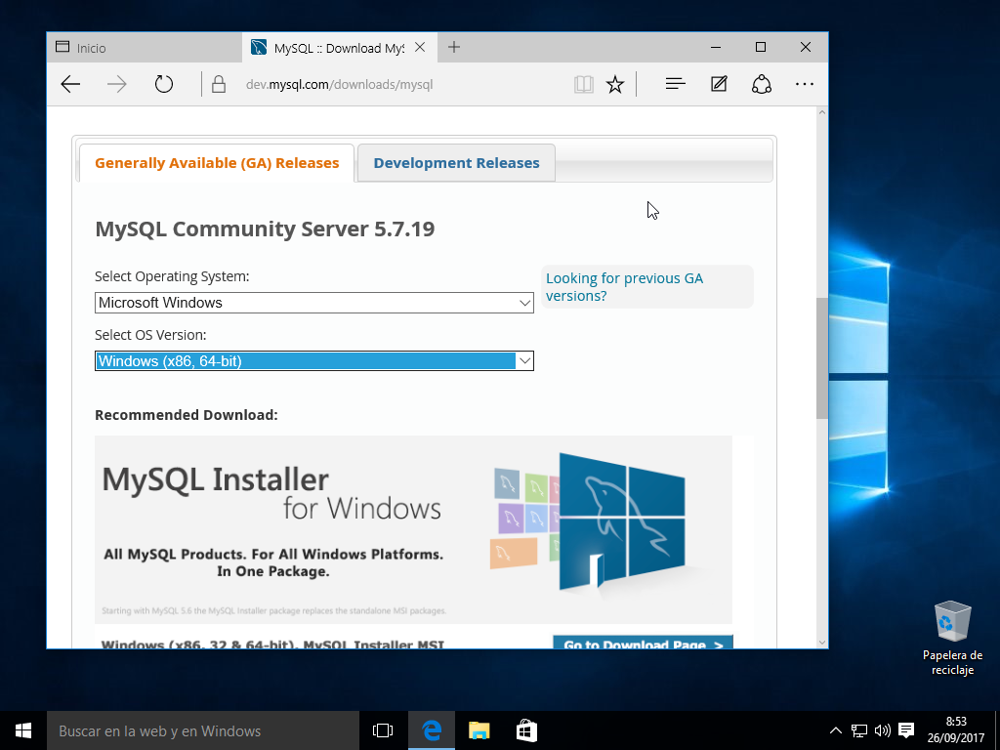

# Instalación MySQL-Server y PHP-MyAdmin.
## 1.Servidor MySQL-Server.
### 1. Instalación.
Nos dirigimos a la sección de descargas de MySQL y descargamos el siguiente paquete.  
  
  

Antes de proceder a la instalación es necesario instalar ciertos paquetes, tales como el *Visual C++ 2013* o el *NetFramework 4.5*, para asegurar el correcto funcionamiento de la aplicación.   
    

Ahora si, arrancamos el instalador.  

Todo este proceso predefinido de instalación se puede dejar por defecto, como se pedía en la actividad. Esto añadirá todo lo necesario para el servidor y su exepción en el *firewall* para permitir conexiones remotas.
  

  

  

  

Aquí estableceremos las contraseña de administrador o *root*.    
  

  

    

### 1.2 Comprobación.
Una vez instalado el servidor, abrimos la consola de MySQL y comprobamos si el acceso *root* se ha configurado bien, que en este caso, así ha sido.
  

Comprobamos que se tiene acceso a la base de datos de *sakila* y de momento todo estaría funcionando como debería ser.  
  

### 1.3 *Workbench*.
El *Workbench* no se instaló por defecto en la instalación del servidor dado que no instalamos el *NetFramework 4.5* previamente. De esta manera se tendrá que instalar el paquete por separado junto con el *Workbench* solo, sin ninguna otra opción ya que es posible que altere alguna opción o configuración del servidor.

Arrancamos el *Workbench* y creamos un nuevo usuario para poder acceder desde la máquina cliente. Aquí aparece como "carmelo" pero este usuario fue modificado a "carmelo-remoto".
  

Es importante comprobar que la opción de *bind-address* este ticada y tenga un " * " (todos) o una IP específica que sería la de la máquina remota.
  

Comprobamos la conexión desde la máquina cliente con el nuevo usuario.
  

Éxito.

## 2. PHP
### 2.1 Instalación y configuración.
La instalación de *PHP-MyAdmin* se realizó desde la aplicación *Xamp*. Es importante que se instale solo esta herramienta y estar seguros de que no se va a instalar nada respeto a *MySQL*, de lo contrario todo el trabajo realizado anteriormente no habrá servido de nada.

Habiendo instalado ya *PHP*, creamos el usuario "pma" y contraseña
"pmapassword" para el acceso a *PHP-MyAdmin*.
  

Nos dirigimos al fichero *config.inc* situado en la carpeta "*../xamp/phpMyAdmin/*" y agregamos el usuario y contraseña anteriores en *User for advanced features*.
  

Ejecutamos un *script* para generar la base de datos de *PHP*. Este *script*  está localizado en "*../xamp/phpMyAdmin/sql/create_tables.sql*".

  

Todo correcto.

Para finalizar, decir que hubo ciertos problemas con este último paso pero eran relacionados a que se había escrito mal la contraseña en el archivo de configuración o que no se había ejecutado el *script.*
