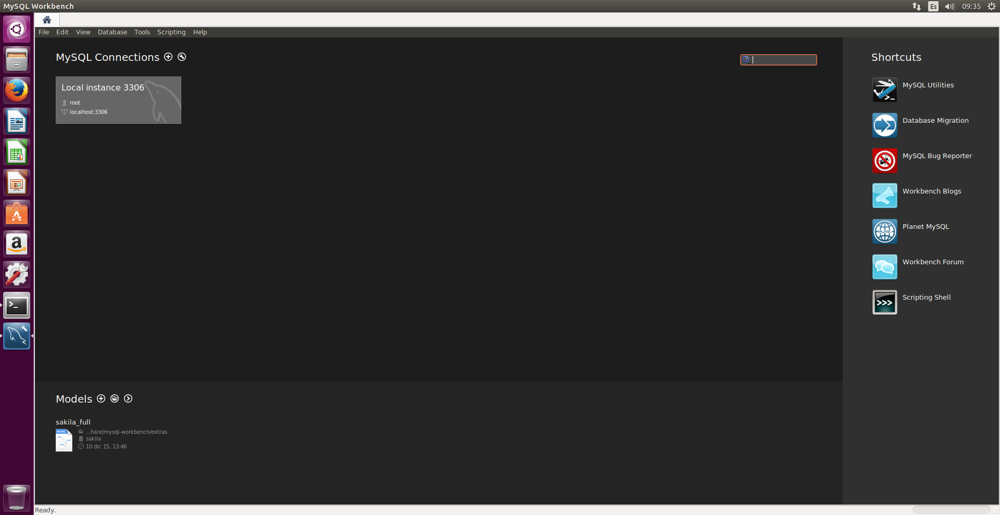
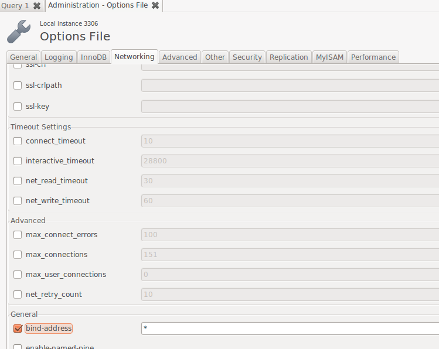
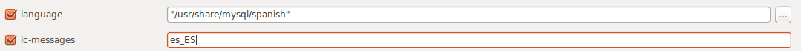

# Instalación MySQL-Server y PHP-MyAdmin / Ubuntu.
## 1. Instalaciones.
### 1.1 MySQL-Server.
Instalamos desde *apt-get install msyql-server*.
  

Configuramos una contraseña.  
  

Reiniciamos el servicio y comprobamos.  
  

Ejecutamos *mysql_secure_installation*. Esto nos permitirá configurar *mysql* con una serie de preguntas referentes a la seguridad del servidor.  

### 1.2 MySQL-Workbench.
Instalamos desde *apt-get install msyql-workbench*.
  

Ejecutamos el programa.  
   

Creamos un usuario *carmelo-remoto*.
  

En *settings* clicamos la llave para asignar una ruta de acceso al archivo de configuración.

Habilitamos todas las conexiones. Esto es opcional y es recomendable especificar un grupo limitado de IPs.
    

### 1.3 MySQL-Client.
Instalamos desde *apt-get install msyql-client*.
  

Y comprobamos la conexión.
  

### 1.4 PHP-MyAdmin.
Instalamos desde *apt-get install msyql-client*.   

Seguimos lo siguintes pasos:    

Especificamos la contraseña de *carmelo-remoto*.   

  

MARCAMOS la opción con el espaciador.    
  

Y comprobamos la conexión.   
   

## 2. Preguntas.
Directorio de instalación base.  
>  

Directorio del servicio o proceso demonio.  
>  

Directorio de datos.  
>  

Fichero de configuración del servidor y su ubicación.  
>  

¿Quién es el usuario propietario de la instalación?.
>mysql

Aplicar el lenguaje de los mensajes de error  a español, modificando la configuración (indicar el directorio donde se aloja el fichero en español)
>  
