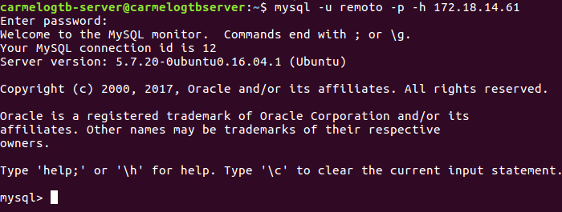

<<<<<<< HEAD
# Ficheros de Log.
  

## Ficheros LOG: Error LOG:
- Explica qué es y para qué sirve el "ERROR LOG"  

- Indica al servidor en "my.cnf" que registre los errores en un fichero llamado. "server_error". Reinicia el servidor y comprueba los mensajes visualizando dicho fichero.  

- Detén el servidor abruptamente (haz lo que sea necesario) y comprueba cómo se ha modificado dicho fichero.  

- Prueba la función "perror" incluida en el directorio bin. ¿Cuál es su objeto? Puedes consultar http://dev.mysql.com/doc/refman/5.7/en/perror.html.  


## Ficheros LOG: General Query LOG
- Explica qué es y para qué sirve el "GENERAL QUERY LOG".  

- Configura MySQL para registrar consultas generales en el fichero denominado "miserver.log". Comprueba su funcionamiento haciendo que un compañero se conecte a tu servidor y ejecute varias consultas.  

- Averigua viendo el fichero "miserver.log" la hora en que se conectó tu compañero y ejecutó las consultas del apartado anterior.  

- Accede al servidor a través de Workbench. ¿Qué se registra en "general_log"?¿Hay alguna diferencia respecto al cliente mysql ?  
=======
# Fichero de Opciones y variables de servidor.

---

## Fichero de opciones

* Haz la lectura de la siguiente página "Using Option Files" http://dev.mysql.com/doc/refman/5.7/en/option-files.html


* Encuentra el fichero my.ini o my.cnf de tu instalación de MySQL (podría no estar en una ubicación no estándar).


* ¿Cómo se escribe un comentario en este fichero?¿Y un grupo de opciones?¿Todas las opciones tienen un valor?
  * Dentro de `/etc/alternatives/my.cnf` usando *--* como `--esto es un ejemplo de comentario`
  o con *#*.
  * Un grupo de opciones empezará como `[Ejemplo]`.
  * Sí.


* Ejecuta "mysqld --verbose --help" desde una consola para ver una lista de las variables del servidor. Para ver mejor el texto mejor redirecciona la salida a fichero.


  


* Explica qué significan y que se consigue con cada una de las variables del siguiente fichero de configuración

 ```cmd
[client]                  --> Cliente.
port=3306                 --> Utiliza el puerto 3306.
password="telesforo";     --> Utiliza la contraseña telesforo.

[mysqld]                  --> Servidor de MySql.
port=3306                 --> Utiliza el puerto 3306.
key_buffer_size=16M       --> Tamaño del buffer.
max_allowed_packet=8M     --> Máximo tamaño permitido del paquete.

[mysqldump]               --> Volcado de datos.
quick                     --> Copia de datos rápida.
```


---

## Variables del servidor.

* Define qué son las variables del servidor.
  * El servidor MySQL tiene muchas variables de sistema que indican cómo está configurado. Cada variable del sistema tiene un valor predeterminado. Las variables del sistema se pueden configurar al inicio del servidor usando opciones en la línea de comando o en un archivo de opciones.


* Usa el comando "SHOW VARIABLES" para conocer el valor de todas las variables y enviar el resultado a un fichero.
  * 

* Repite lo anterior para mostrar solo las variables relacionadas con el motor "InnoDB".
  * Sería `show variables like "InnoDB;"`.

* Para gestionar variables tenemos, como hemos visto, el comando SHOW "comando":
  * cómo mostrar todos los motores de almacenamiento
    * show engines
  * cómo mostrar el estado actual del servidor
    * show status
  * cómo averiguar todos los clientes que están conectados al servidor
    * show processlist
  * cómo conocer todas las tablas que están abiertas
    * show open tables

---

## Variables de estado.

* Define qué son las variables de estado.
  * Varias variables de estado proporcionan recuentos de declaraciones. Para determinar el número de sentencias ejecutadas, use estas relaciones. El servidor MySQL mantiene muchas variables de estado que proporcionan información sobre su funcionamiento.  


* Usa el comando "SHOW STATUS" para conocer el valor de todas las variables..
  *    

* Haz que uno o más de tus compañeros se conecte a tu servidor (puede que por cuestión de permisos no os podáis conectar).
  * 

* Comprueba quién está conectado usando el comando correspondiente (Pista: es un comando visto SHOW XYZ).
  * 

* Intenta desconectarlo con el comando "kill"
  *   

    

* ¿Cuántas consultas se están ejecutado hasta el momento en tu servidor MYSQL? ¿Y si se trata de consultas lentas?
  *   


* Un estado informa  el sobre el máximo de conexiones concurrentes que se ha dado en la sesión de trabajo. ¿Cuál es?
  *   

---

## Variables dinámicas.

* Detalla los posibles atributos que tendría una variable de servidor como "port".
  * Variable Scope = Global
  * Dynamic Variable = No
  * Type = INT
  * Default = 3306
  * Min Value = 0
  * Max Value = 65535

* ¿Cómo podemos saber si una variable es dinámica o no?
  * El campo *Dynamic Variable* tendra un *Sí/No* o un *Yes/No*.

* ¿Qué hace la variable "uptime"?
  * Tiempo de la sesión del servidor.
  * Indica su valor en tu servidor
    * 5064  

      

  * ¿Es posible modificar su valor con comando SET?
    * No

* Localiza la variable que establece el límite de conexiones concurrentes. ¿Cuál es?
    * `max_connect_error`     

      
>>>>>>> e759901bf4f5ec5e74d14685736762cea107ecde
