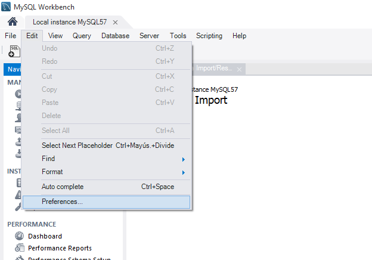
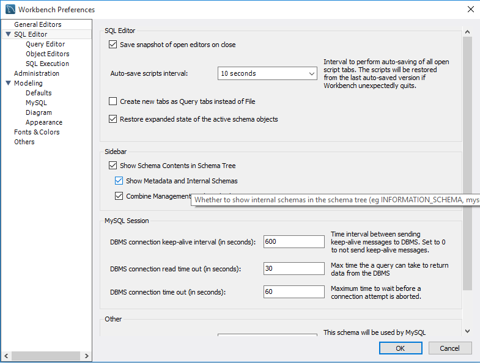
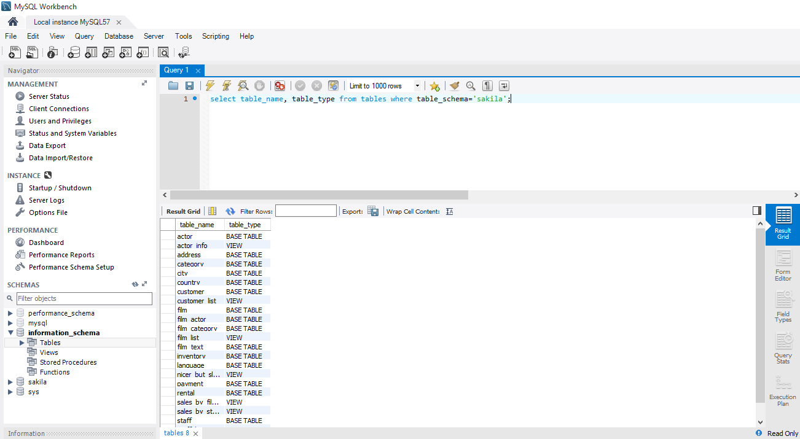
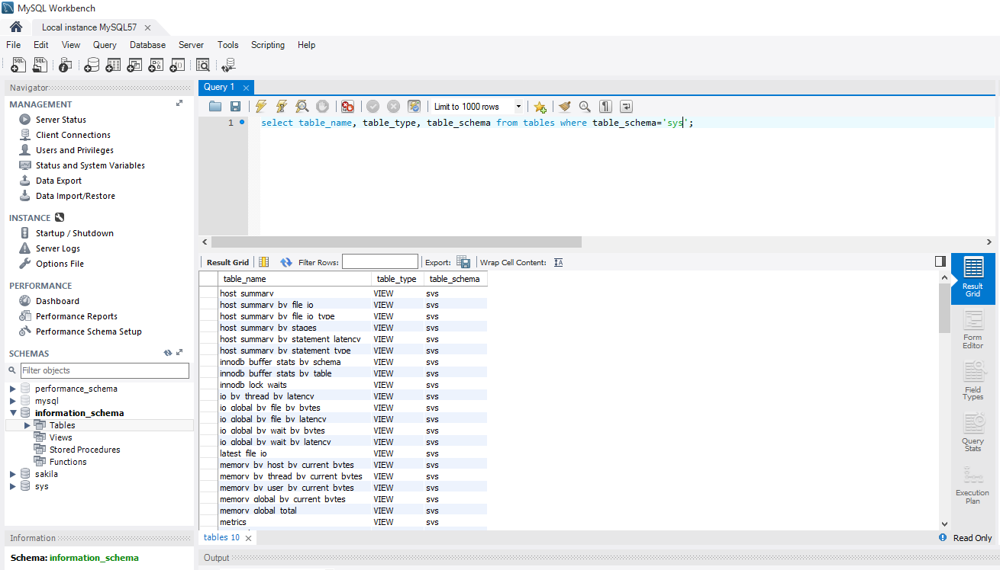
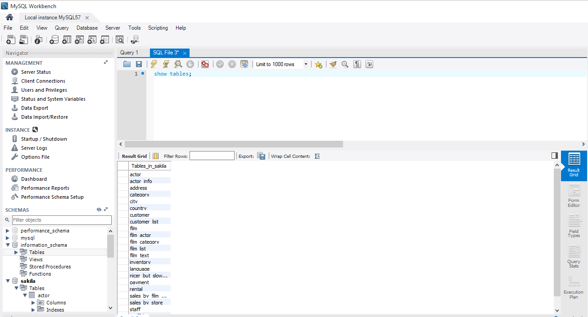
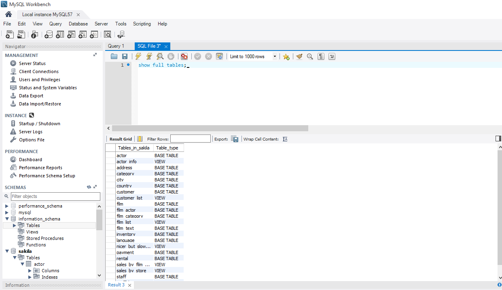
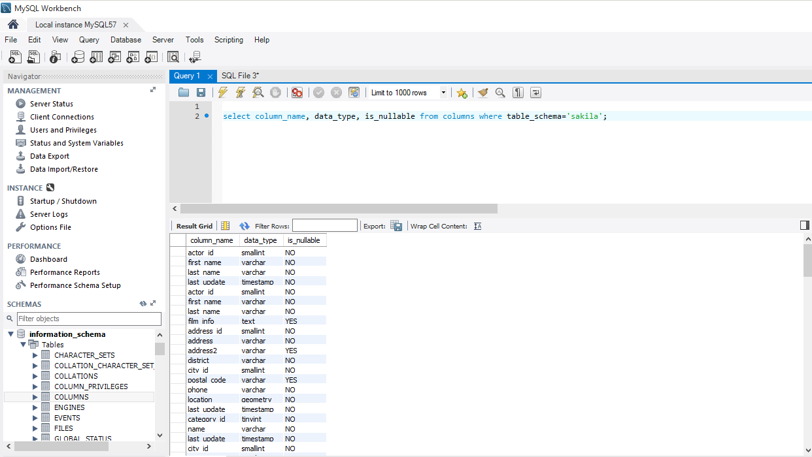
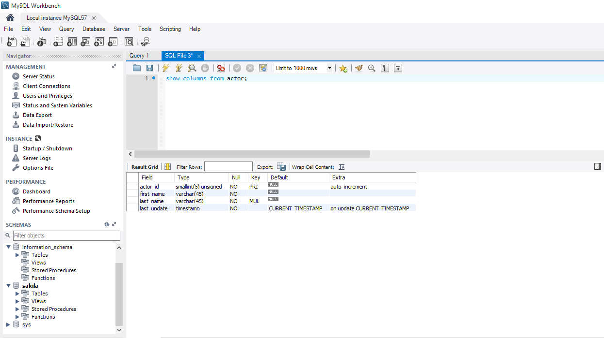

# MYSQL - DICCIONARIOS.    

## Responde las siguientes preguntas:
Para poder acceder a la base de datos *INFORMATION_SCHEMA* debemos antes activar la opción *Show Metadata and Internal Schemas* dentro de `Edit > Preferences > Sql Editor` dado que viene desactivado por defecto. Dicha base de datos contiene información de todas las bases de datos almacenadas en el servidor; una base de datos de bases de datos.
      

  

**1. Interrogando la bases de datos Information_schema, extrae información (atributos table_name, table_type) sobre las tablas que conforman la base de datos "sakila".**   
Sería `select table_name, table_type from tables where table_schema="sakila;"`.
  

Aquí otro ejemplo filtrando esta vez a la BD de *sys*.
    

**2.¿Cuál es el comando SHOW equivalente al anterior?**  
Nos dirigismos a la BD de *sakila* y ejecutamos el comando. Si no agregamos el atributo *full* a `show full tables;` no se verá el *Table_Type*.
    

  

**3.Repite lo mismo extrayendo la información sobre el esquema de una tabla en particular de la base de datos "sakila" (atributos column_name, data_type, is_nullable, column_default). Usar tabla columns.**  
Sería `select column_name, data_type, is nullable from columns where table_schema="sakila"; `  
  

**4.¿Cuál es el comando SHOW equivalente al anterior?**   
Nos situamos en *sakila* e introducimos `show columns from actor;`  
  

**5.Atendiendo a la base de datos "Information_schema", ¿cuáles son las tablas principales según tu criterio? Puedes ayudarte para ver todas las tablas utilizando Workbench. Para ello ir a preferencias y activar ver los metadatos.**  
Todas las tablas tienen su importancia, dado que cada una desempeña una función primordial. Dicho esto, pienso que podrían ser *columns* (contienen las BD) y *engines* (motor de la BD).
