# Ficheros de Log.
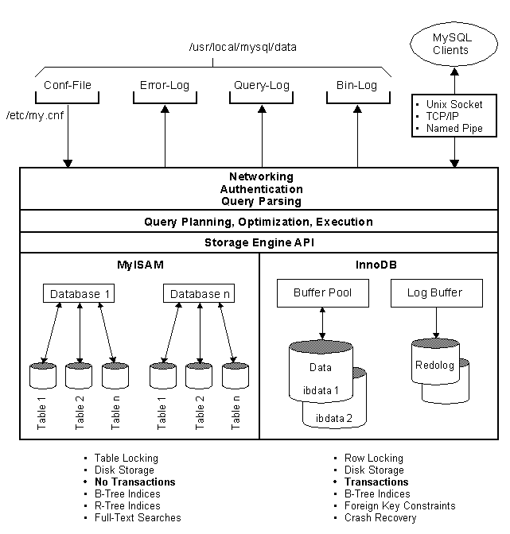  

## Ficheros LOG: Error LOG:
- **Explica qué es y para qué sirve el "ERROR LOG".**   
Es un tipo de fichero de registro el cual almacena los errores que ha sufrido el sistema.    

 - **Indica al servidor en "my.cnf" que registre los errores en un fichero llamado. "server_error". Reinicia el servidor y comprueba los mensajes visualizando dicho fichero.**   
 Comenzamos añadiendo la ruta del archivo de log en `C:\ProgramData\MySQL\MySQL Server 5.7\Data\miservidor_error.log`.  
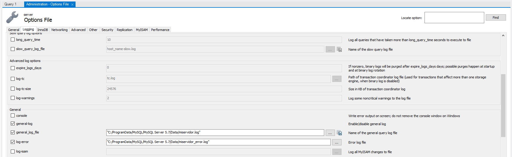      

   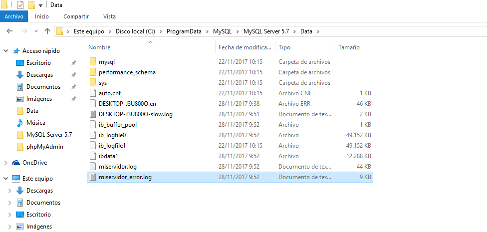

   Comprobamos que se ha realizado el cambio en `my.cnf`.  
   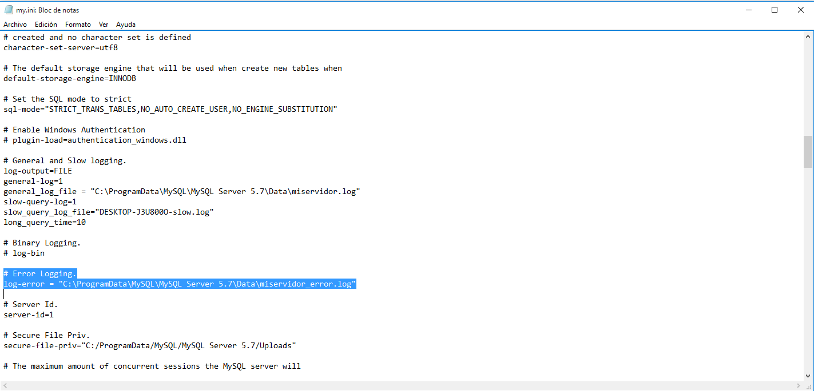  

   Y revisamos que se están almacenando todos los posibles errores en dicho fichero.    
   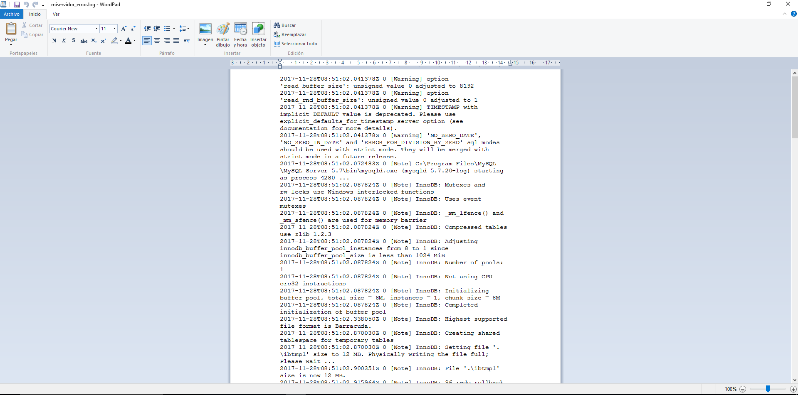

- **Detén el servidor abruptamente (haz lo que sea necesario) y comprueba cómo se ha modificado dicho fichero.**     
Se paró el servicio desde el *Administrador de Tareas*
y se registró lo siguiente.  
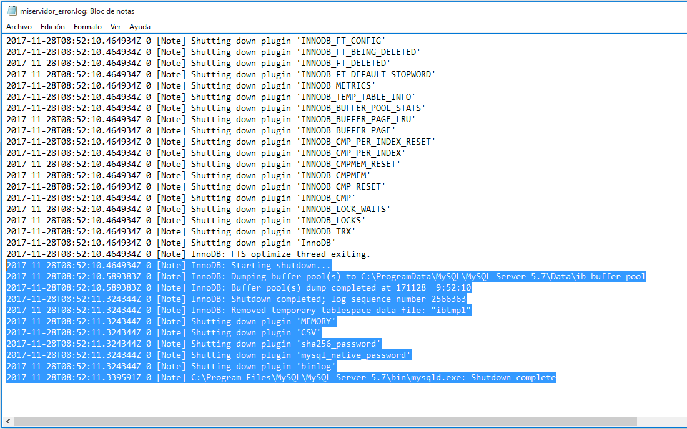

- **Prueba la función "perror" incluida en el directorio bin. ¿Cuál es su objeto? Puedes consultar http://dev.mysql.com/doc/refman/5.7/en/perror.html.**  
Muestra los errores desde una consola cliente, en este caso, la *cmd* de Windows.  
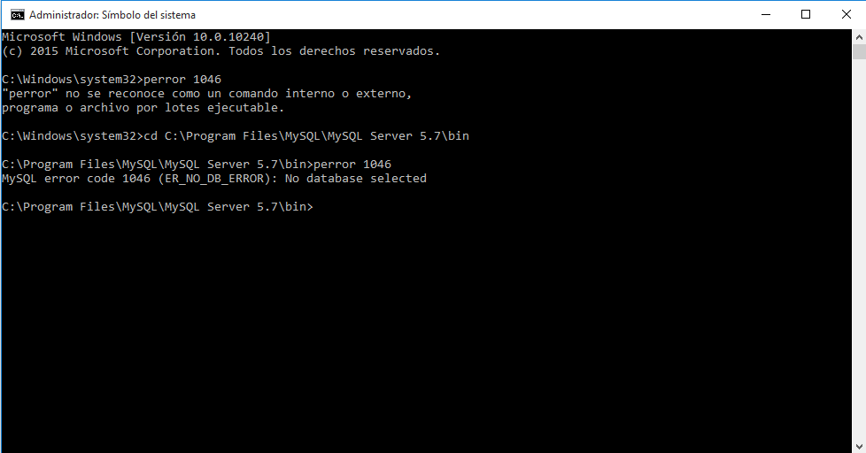  

## Ficheros LOG: General Query LOG
- **Explica qué es y para qué sirve el "GENERAL QUERY LOG".**  
Es un tipo de fichero de registro que almacena todas las consultas realzadas en el sistema.  

- **Configura MySQL para registrar consultas generales en el fichero denominado "miserver.log". Comprueba su funcionamiento haciendo que un compañero se conecte a tu servidor y ejecute varias consultas.**   
Desde *MySQL Workbench* activamos el *general_log* y le indicamos la ruta `C:\ProgramData\MySQL\MySQL Server 5.7\Data\miservidor_error.log`.  
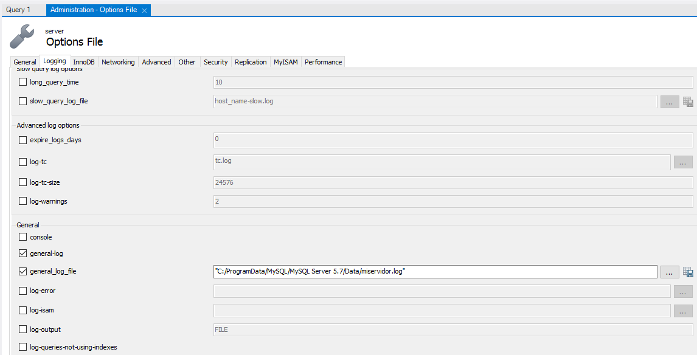    

  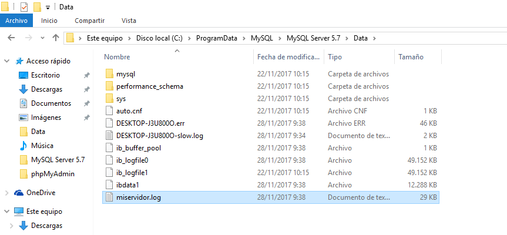  

  Comprobamos que se ha modificado el fichero *my.cnf*.      
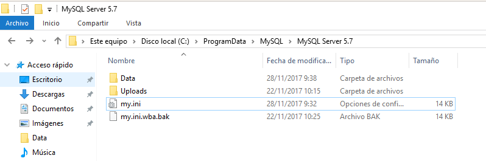     

  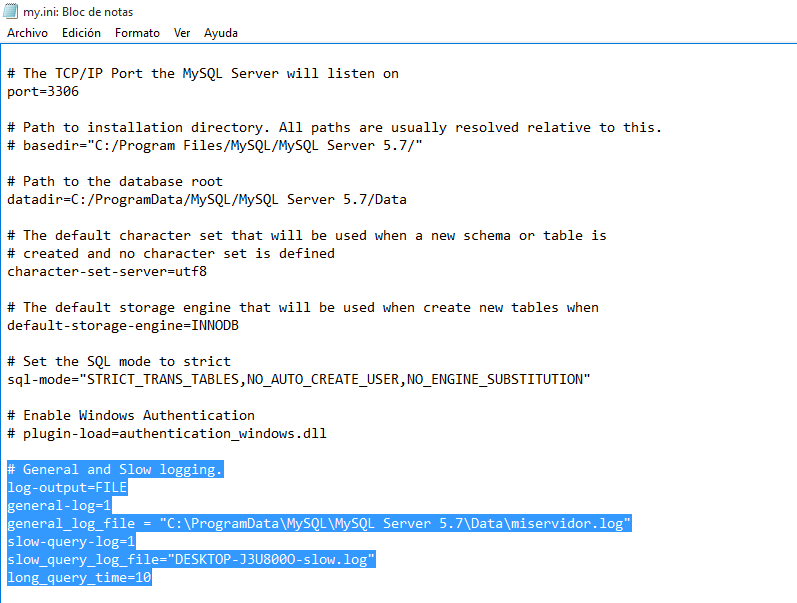     

  Y por último comprobamos que se están almacenando las consultas en el fichero definido.  
  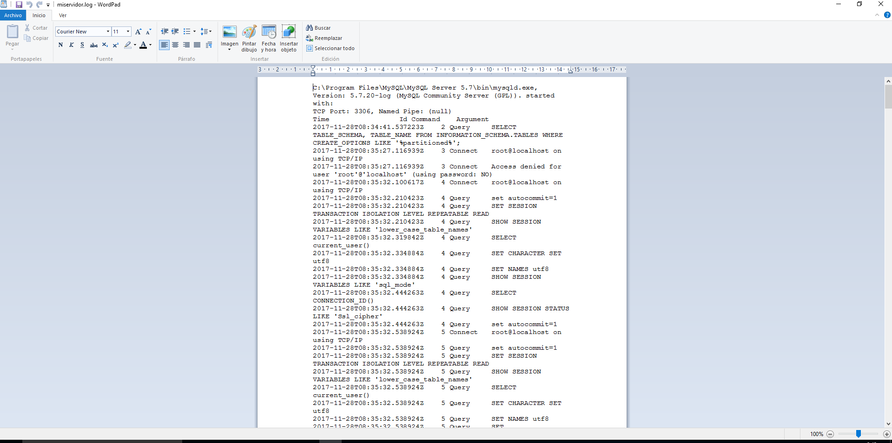   

- **Averigua viendo el fichero "miserver.log" la hora en que se conectó tu compañero y ejecutó las consultas del apartado anterior.  
Accede al servidor a través de Workbench. ¿Qué se registra en "general_log"?¿Hay alguna diferencia respecto al cliente mysql?**    
Estas dos preguntas se han resolvido en una. Se ejecuto una consulta desde el cliente y se comprobo en en *general_log* de *MySQL Workbench*.    
`select 2+2;`
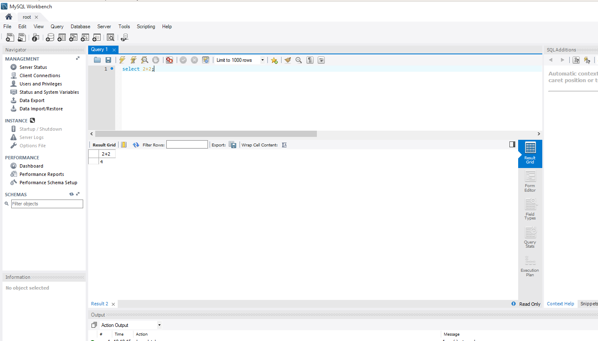  

  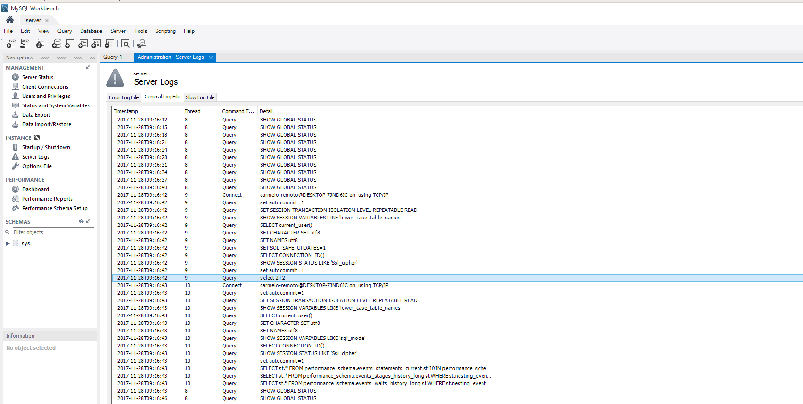
