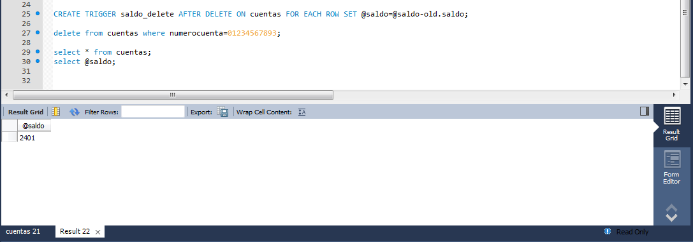

# Triggers.
Creamos la base de datos *banco* y la tabla *cuentas*.  
    

Creamos una variable local llamada *saldo* con el valor *0* y a continuación el trigger que irá acumulando en esta variable todos los sueldos de los diferentes números de cuentas (se ha ejecutado un insert como demostración).  
  

Y como podemos comprobar, se ha acumulado correctamente.  
    

En caso de que la variable local *saldo* se pueda actualizar en caso de borrado, tendremos que ejecutar el trigger de la siguiente manera (se ha ejeuctado un borrado como demostración).  
  

Se ha actualizado, correctamente.  

