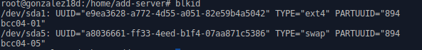

# Clientes Ligeros / LTSP  
___
## 1. Preparación de máquinas.
### 1.1 Tarjetas de red.
Preparación de los adaptadores de red en Virtual Box, tanto como en servidor:

Como en el cliente:

  >Tener en cuenta que el servidor LTSP deberá tener la suficiente RAM para aguantar el  
   número necesario de clientes.  
   *Fórmula orientativa: 1500 + (30 x N_FAT_CLIENTS)  + (300 xN_THIN_CLIENTS)*

### 1.2 Configuración del SO.

> ip a   

> route -n  

> hostname, hosthame -a, hostname -f, uname   

> blkid

  

### 1.3 SSH.

Comprobamos si SSH está instalado con con *dpkg -l ssh*.

Por lo tanto, habrá que instalarlo con *apt-get install ssh*.

Creamos los usuarios que se usaran en los clientes LTSP.

Modificamos el archivo de configuración para permitir el acceso *root*.

Y su comprobación con SSH.  

___
## 2. LTSP.  
### 2.1 Instalación.  
Instalamos el servicio.
>apt-get install ltsp-server-standalone

Y generamos una imagen del sistema mediante.
>ltsp-build-cliente (para 64bits)  
>ltsp-build-cliente i386 (para 32bits)

  

Con VB suele dar un error con las imágenes de 64bits (que veremos más adelante), por lo que me vi forzado a repetir la imagen, pero en su versión de 32bits. AL parecer el problema tiene que ver con la memoria de video virtual que proporciona VB.

Proceso de creación de la ISO.  

### 2.2 Comprobaciones.

>ltsp-info  

En */etc/ltsp/dhcpd.conf* modicamos el rango IP para el DHCP, que en mi caso sería *range 192.168.67.118 192.168.67.218*

Apagamos y reiniciamos el servicio (con un simple *reload* habría bastado).  
  

## 3. Cliente.
Arrancamos la máquina desde la red por primera vez y ocurre lo siguiente:  
1º. Me enlaza el cliente con el host pero no carga bien la imagen de 64 bits.  
2º. Genero una imagen de 32 bits que da lugar a un bug gráfico.

En mi caso se solucionó aumentando la *vram* de VB y habilitando la aceleración 3D/2D.

Una vez dentro, comprobamos:
>ip a  

  
> whoami, who, arp, netstat -ntap   

