# VNC-Conexión remota.
## 1. Suse
### 1.1 Configuración y comprobación.
Antes de hacer una conexión remota, debemos ejecutar el siguiente comando en el servidor a conectar, donde habililitaremos el servicio y podremos configurar las contraseñas de acceso.  
Esto también iniciará el servicio vnc. Cada vez que arranquemos el servidor habrá que ejecutar este servicio, de no hacerse la conexión será rechazada.
>vncserver  

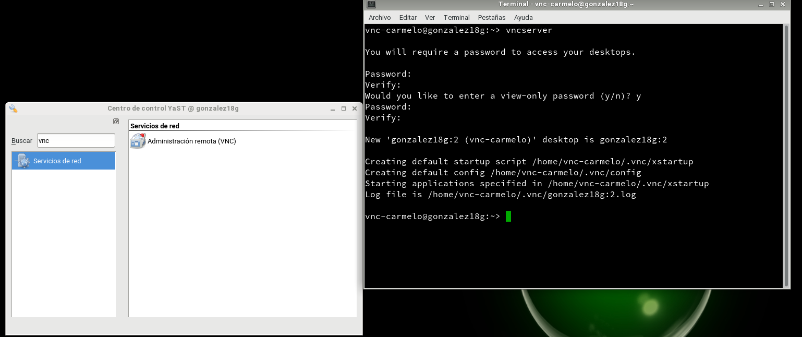  

Habilitamos también una exepción en el *firewall* para que permita las conexiones VNC. Esto se ha hecho desde *Yast*.  
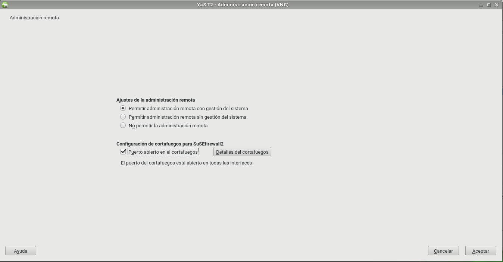  

Lanzamos el programa *vncviewer* desde la consola, el cual nos habrirá una pestaña en la que podremos poner la IP de la máquina a conectar y especificar el puerto, en este caso, el 5901.
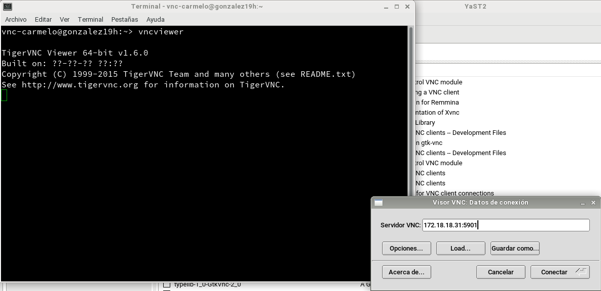  

 La conexión ha sido un éxito.  
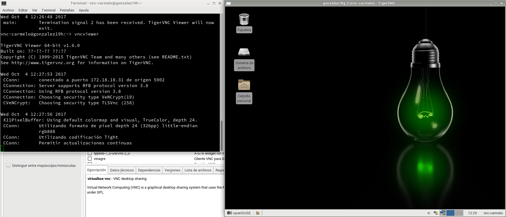  

Ahora lo probamos desde la máquina 2 a la máquina 1, realizando los paso anteriores y comprobamos si hay conexión.  
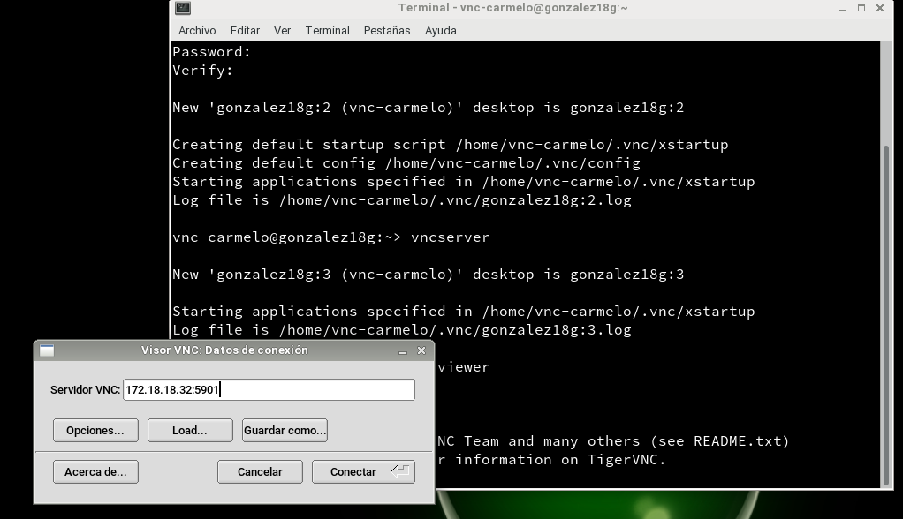  

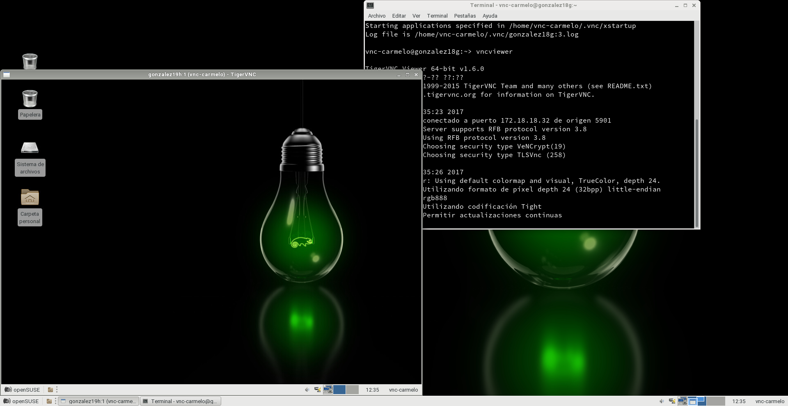  

## 2. Windows.
### 2.1 Configuración y comprobación.
Asignamos IPS:

Máquina 1:  
  

Máquina 2:  
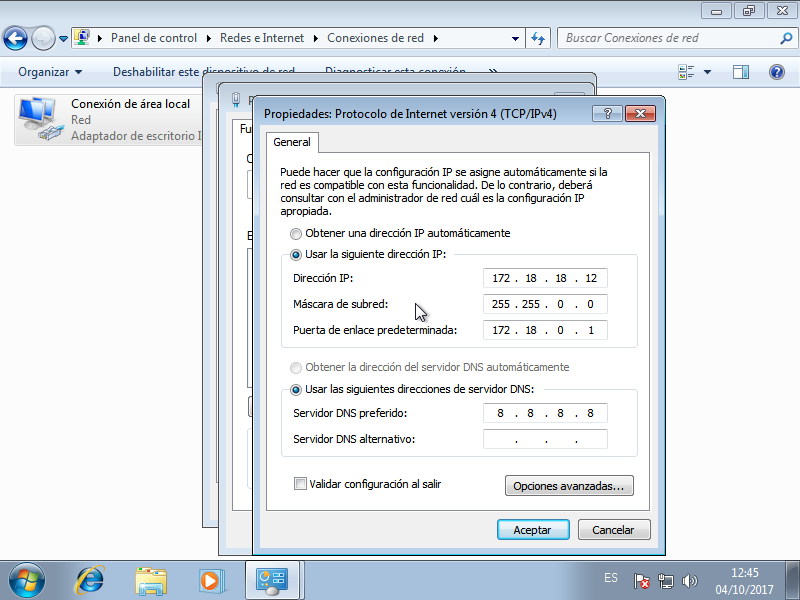  

Instalamos *TightVNC*.  
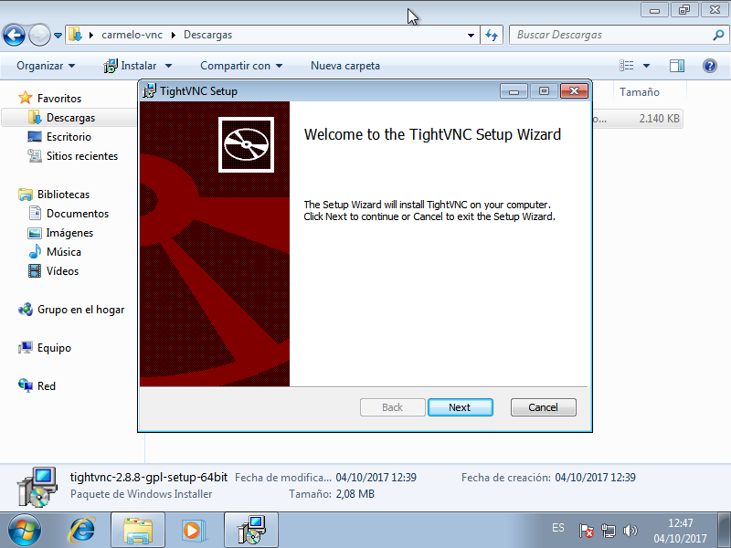  

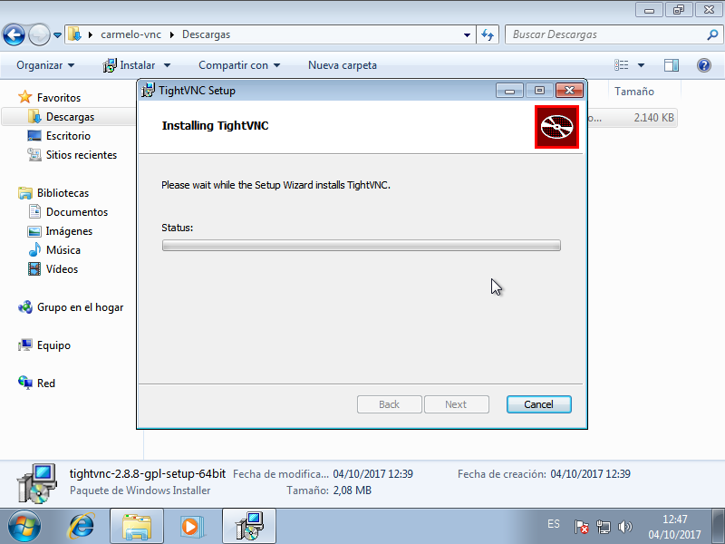  

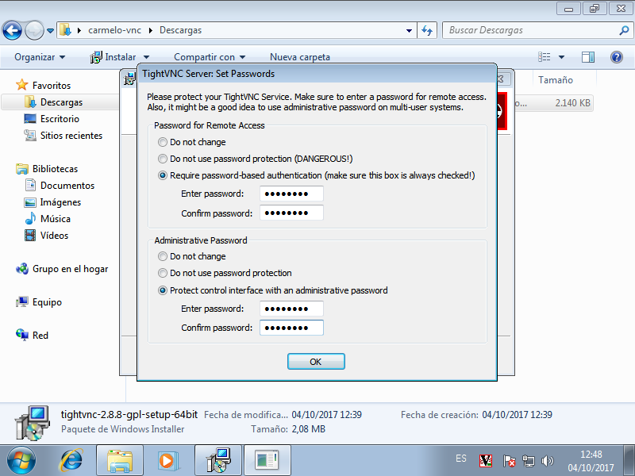  

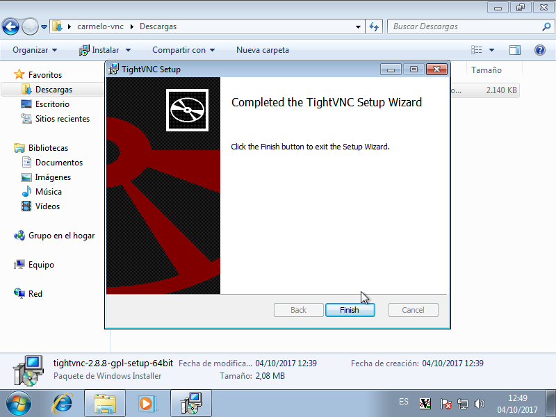  

Una vez acabada la instalación, probramos la conexión. Destacar que no ha sido necesario añadir una exepción en el firewall manualmente dado que el instalador te da la opción de añadir esta exepción automáticamente.  
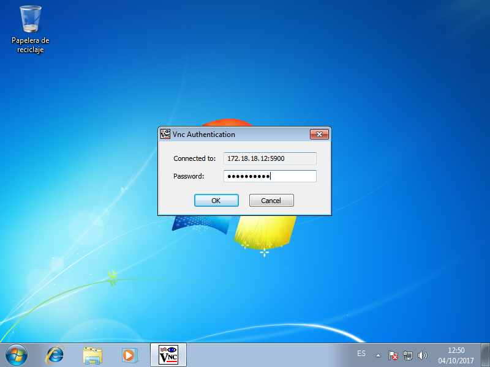  

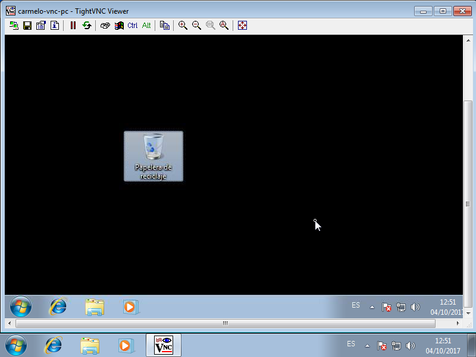   

Y ahora, de la máquina 2 a la máquina 1, siguiendo los pasos previos.
  

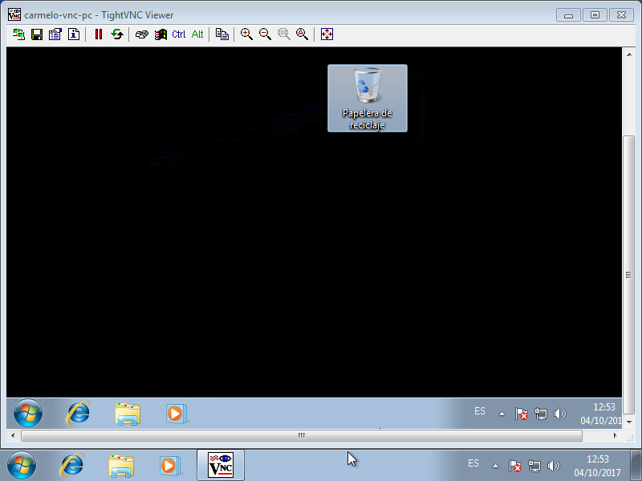   

## 3. Suse-Windows y viceversa.
No hay ninguna diferencia en especial. Solo tendremos que especificar la IP de la máquina a conectar y el puerto.
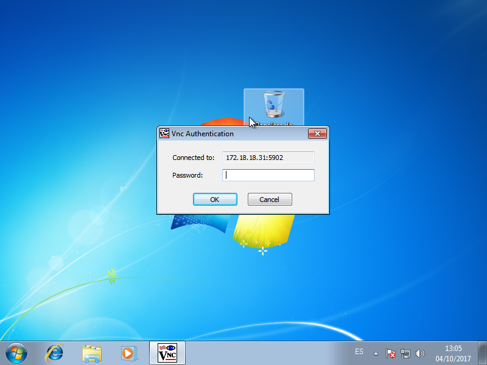  

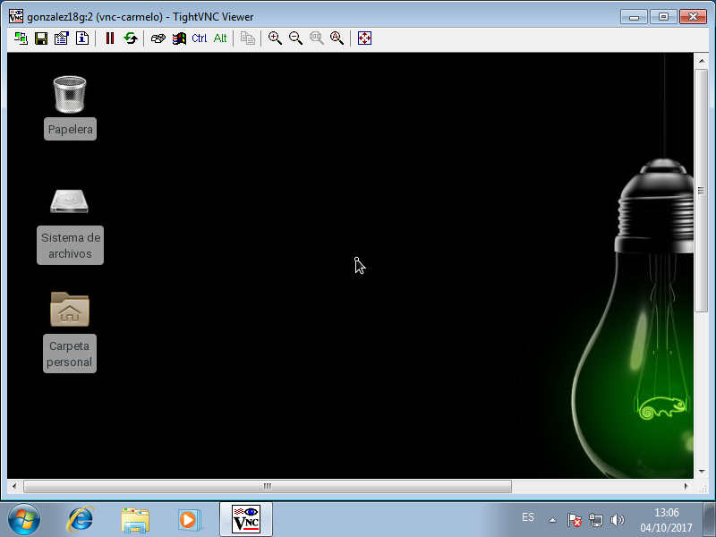   

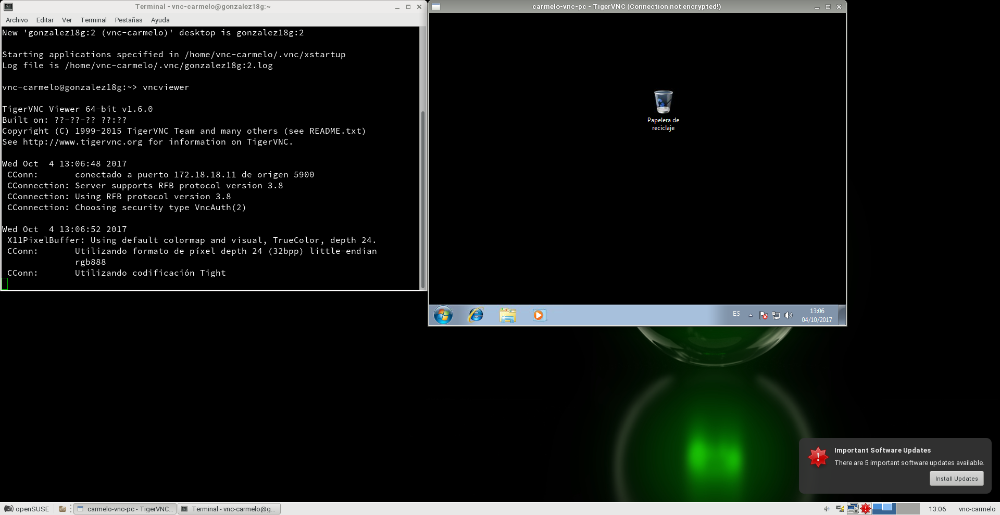  
