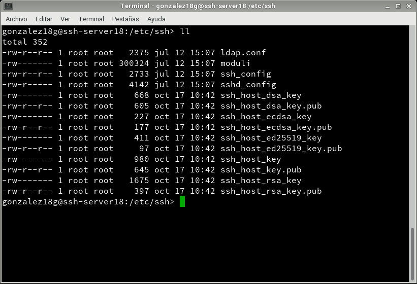
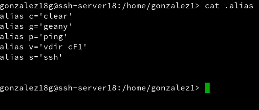

# Acceso remoto SSH.
## 1. Preparativos.
### 1.1 Servidor SSH.

Configurar el servidor GNU/Linux con siguientes valores:    

        SO GNU/Linux: OpenSUSE
        IP estática: 172.18.XX.31
        Nombre de equipo: ssh-serverXX
        Configuración de las MV's  

Añadir en `/etc/hosts` los equipos ssh-clientXXa y ssh-clientXXb (Donde XX es el puesto del alumno).  
Para comprobar los cambios ejecutamos varios comandos. Capturar imagen:

`ip a               #Comprobar IP y máscara`
  

`route -n           #Comprobar puerta de enlace`


`ping 8.8.4.4 -i 2  #Comprobar conectividad externa`
  

`host www.google.es #Comprobar el servidor DNS`
  

`ping ssh-clientXXa #Comprobar conectividad con cliente A`  
`ping ssh-clientXXb #Comprobar conectividad con cliente B`


`lsblk              #Consultar particiones  `  
  

`blkid              #Consultar UUID de la instalación`  


Crear los siguientes usuarios en ssh-serverXX:  

        primer-apellido-del-alumno1
        primer-apellido-del-alumno2
        primer-apellido-del-alumno3
        primer-apellido-del-alumno4

    


Para establecer una contraseña:  


### 1.2 Cliente GNU/Linux.
Configurar el cliente1 GNU/Linux con los siguientes valores:  

        SO OpenSUSE
        IP estática 172.18.XX.32
        Configuración de las MV's
        Nombre de equipo: ssh-clientXXa  

Añadir en `/etc/hosts` el equipo ssh-serverXX, y ssh-clientXXb.  
Comprobar haciendo ping a ambos equipos.  


### 1.3 Cliente Windows.

Instalar software cliente SSH en Windows. Para este ejemplo usaremos PuTTY.

Configurar el cliente2 Windows con los siguientes valores:
        SO Windows 7
        IP estática 172.18.XX.11
        Nombre de equipo: ssh-clientXXb
        Configuración de las MV's

Añadir en `C:\Windows\System32\drivers\etc\hosts` el equipo ssh-serverXX y ssh-clientXXa.    


Comprobar haciendo ping a ambos equipos.

## 2 Instalación del servicio SSH.
Instalar el servicio SSH en la máquina ssh-server   

Desde la herramienta yast -> Instalar Software
Desde terminal zypper search openssh muestra los paquetes instalados o no con nombre openssh*.
Desde terminal zypper install openssh, instala el paquete OpenSSH.

Los ficheros de configuración del servicio se guardan en /etc/ssh.  
  

### 2.1 Comprobación.
Desde el propio ssh-server, verificar que el servicio está en ejecución.

`systemctl status sshd` - Esta es la forma de comprobarlo en systemd:
  

`ps -ef | grep sshd` - Esta es la forma de comprobarlo mirando los procesos del sistema.

Para poner el servicio enable, si no lo estuviera.:


        >systemctl enable sshd por comandos
        >Yast -> servicios por entorno gráfico

`netstat -ntap: Comprobar que el servicio está escuchando por el puerto 22.`
  


### 2.2 Primera conexión SSH desde ssh-clientXXa.

Comprobamos la conectividad con el servidor desde el cliente con ping ssh-serverXX.
Desde el cliente comprobamos que el servicio SSH es visible con nmap -Pn ssh-serverXX.
Debe mostrarnos que el puerto 22 está abierto.

`zypper-nmap`  
  

`ssh-nmap`  


Si esto falla debemos comprobar en el servidor la configuración del cortafuegos.

Vamos a comprobar el funcionamiento de la conexión SSH desde cada cliente usando el usuario 1er-apellido-alumno1.
Desde el ssh-client1 nos conectamos mediante ssh 1er-apellido-alumno11@ssh-server.
Capturar imagen del intercambio de claves que se produce en el primer proceso de conexión SSH.  


Y desde PuTTY.  
  


Comprobar contenido del fichero `$HOME/.ssh/known_hosts` en el equipo ssh-client1.
OJO si el prompt pone ssh-server están el el servidor, y si pone ssh-client1 están el el cliente1.  


## 3. ¿Y si cambiamos las claves del servidor?

Confirmar que existen los siguientes ficheros en /etc/ssh, Los ficheros ssh_host*key y ssh_host*key.pub, son ficheros de clave pública/privada que identifican a nuestro servidor frente a nuestros clientes:
```console
-rw-r--r-- 1 root root 136156 ago 24  2012 moduli  
-rw-r--r-- 1 root root   1667 sep 12  2012 ssh_config  
-rw-r--r-- 1 root root   2487 dic 27  2013 sshd_config  
-rw------- 1 root root    672 dic 27  2013 ssh_host_dsa_key  
-rw-r--r-- 1 root root    601 dic 27  2013 ssh_host_dsa_key.pub  
-rw------- 1 root root    227 dic 27  2013 ssh_host_ecdsa_key    
-rw-r--r-- 1 root root    173 dic 27  2013 ssh_host_ecdsa_key.pub  
-rw------- 1 root root    528 dic 27  2013 ssh_host_key  
-rw-r--r-- 1 root root    333 dic 27  2013 ssh_host_key.pub    
-rw------- 1 root root   1675 dic 27  2013 ssh_host_rsa_key     
-rw-r--r-- 1 root root    393 dic 27  2013 ssh_host_rsa_key.pub  
```


-Modificar el fichero de configuración SSH (`/etc/ssh/sshd_config`) para dejar una única línea: HostKey `/etc/ssh/ssh_host_rsa_key`. Comentar el resto de líneas con configuración HostKey. Este parámetro define los ficheros de clave publica/privada que van a identificar a nuestro servidor. Con este cambio decimos que sólo vamos a usar las claves del tipo RSA.  


**Regenerar certificados.**  
Vamos a cambiar o volver a generar nuevas claves públicas/privadas para la identificación de nuestro servidor.

En ssh-server, como usuario root ejecutamos:
`ssh-keygen -t rsa -f /etc/ssh/ssh_host_rsa_key`  
  

No poner password al certificado de la máquina.
Reiniciar el servicio SSH: `systemctl restart sshd`.
Comprobar que el servicio está en ejecución correctamente:   


**Comprobamos.**  
Comprobar qué sucede al volver a conectarnos desde los dos clientes, usando los usuarios 1er-apellido-alumno2 y 1er-apellido-alumno1.
¿Qué sucede?


Pero desde Windows se conoce que PuTTY regenera las claves necesarias para establecer una conexión.  
   


**Servicio SSH en Windows:**      
En Windows, la información relativa a los know_hosts, se almacena en el registro. En la ruta `CURRENT_USER/Software/SimonTaham/Putty/SSHHostKeys`. Para acceder al registro ejecutamos el comando "regedit".

## 4. Personalización del prompt Bash.
Esto sólo para servidores GNU/Linux o BSD.

Personalizar Bash según la documentación, para cambiar el color cuando tenemos activa una sesión SSH.

Por ejemplo, podemos añadir las siguientes líneas al fichero de configuración del usuario1 en la máquina servidor (Fichero `/home/1er-apellido-alumno1/.bashrc`).  

**Se cambia el prompt al conectarse vía SSH:**
```console
if [ -n "$SSH_CLIENT" ]; then  
  PS1="AccesoRemoto_\e[32m\u@\h:\e[0m \w\a\$ "    
else  
  PS1="\[$(pwd)\]\u@\h:\w>"  
fi  
```


Además, crear el fichero el fichero `/home/1er-apellido-alumno1/.alias`, donde pondremos el siguiente contenido:

```console
alias c='clear'  
alias g='geany'  
alias p='ping'  
alias v='vdir -cFl'  
alias s='ssh'  
```


Comprobar funcionamiento de la conexión SSH desde cada cliente.    


## 5. Autenticación mediante claves públicas.
El objetivo de este apartado es el de configurar SSH para poder acceder desde el cliente1, usando el 1er-apellido-alumno4 sin poner password, pero usando claves pública/privada.

Para ello, vamos a configurar la autenticación mediante clave pública para acceder con nuestro usuario personal desde el equipo cliente al servidor con el usuario 1er-apellido-alumno4.

Vamos a la máquina ss-clientXXa.  
**¡OJO! No usar el usuario root.**

Capturar imágenes de los siguientes pasos:
Iniciamos sesión con nuestro usuario nombre-alumno de la máquina ssh-clientXXa.   
Ejecutamos `ssh-keygen -t rsa` para generar un nuevo par de claves para el usuario en `/home/nuestro-usuario/.ssh/id_rsa` y  `/home/nuestro-usuario/.ssh/id_rsa.pub`.    


Ahora vamos a copiar la clave pública (id_rsa.pub) del usuario (nombre-de-alumno) de la máquina cliente, al fichero "authorized_keys" del usuario remoto 1er-apellido-alumno4 (que está definido en el servidor.  
Hay dos formas de hacerlo:  
El modo recomendado es usando el comando ssh-copy-id.   
Ejemplo para copiar la clave pública del usuario actual al usuario remoto en la máquina remota: `ssh-copy-id usuario-remoto@hostname-remoto`.  


Otra forma de hacerlos sería usando el programa de copia segura scp.

Comprobar que existe el directorio `/home/1er-apellido-alumno4/.ssh` en el servidor.  

Copiamos el fichero `.ssh/id_rsa.pub` local al fichero `.ssh/authorized_keys` del usuario remoto en la máquina remota.  


Comprobar que ahora al acceder remotamente vía SSH.  
Desde ssh-clientXXa, NO se pide password.  


Desde ssh-clientXXb, SI se pide el password.  


## 6. Uso de SSH como túnel para X.
Instalar en el servidor una aplicación de entorno gráfico (APP1) que no esté en los clientes. Por ejemplo Geany. Si estuviera en el cliente entonces buscar otra aplicación o desinstalarla en el cliente.    


Consultar fichero de configuración `/etc/ssh/sshd_config` (Opción X11Forwarding yes) -->En mi caso ya estaba.

Vamos al clienteXXa.

Comprobar que no está instalada APP1: zypper se APP1.  


Con el comando `ssh -X remoteuser1@ssh-server`, podemos conectarnos de forma remota al servidor, y ahora ejecutamos APP1 de forma remota. El parámetro es -X en mayúsculas, no minúsculas.  


Para ver los logs del sistema usar `journalctl`.

## 7. Aplicaciones Windows nativas.

Podemos tener aplicaciones Windows nativas instaladas en ssh-server mediante el emulador WINE.

Instalar emulador Wine en el ssh-server.    


Ahora podríamos instalar alguna aplicación (APP2) de Windows en el servidor SSH usando el emulador Wine. O podemos usar el Block de Notas que viene con Wine: wine notepad.  
Comprobar el funcionamiento de APP2 en ssh-server.    


Comprobar funcionamiento de APP2, accediendo desde ssh-client1.  


## 8. Restricciones de uso.
Vamos a modificar los usuarios del servidor SSH para añadir algunas restricciones de uso del servicio.  

**Restricción sobre un usuario.**  

Vamos a crear una restricción de uso del SSH para un usuario:  
En el servidor tenemos el usuario remoteuser2. Desde local en el servidor podemos usar sin problemas el usuario.  


Vamos a modificar SSH de modo que al usar el usuario por ssh desde los clientes tendremos permiso denegado.  

Capturar imagen de los siguientes pasos:  

Consultar/modificar fichero de configuración del servidor SSH (`/etc/ssh/sshd_config`) para restringir el acceso a determinados usuarios. Consultar las opciones AllowUsers, DenyUsers.  


Comprobarlo la restricción al acceder desde los clientes.  

**Restricción sobre una aplicación**  
Vamos a crear una restricción de permisos sobre determinadas aplicaciones.  

Crear grupo remoteapps.  
Incluir al usuario remoteuser4 en el grupo remoteapps.    


Localizar el programa APP1. Posiblemente tenga permisos 755.  
  

Poner al programa APP1 el grupo propietario a remoteapps.   
Poner los permisos del ejecutable de APP1 a 750. Para impedir que los usurios que no pertenezcan al grupo puedan ejecutar el programa.   


Comprobamos el funcionamiento en el servidor.  


Comprobamos el funcionamiento desde el cliente.    

