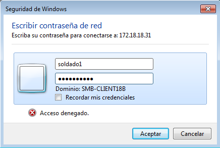
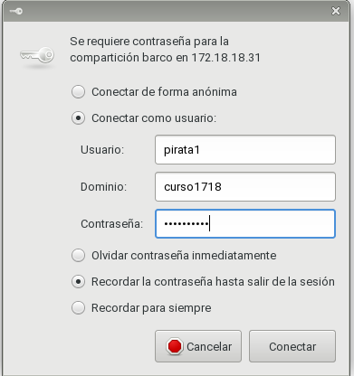
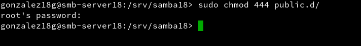

# SAMBA
## 1. Servidor.
### 1.1 Instalación.  
Comprobamos que la configuración es la que se ha pedido.  

  

  

    

Añadimos los clientes al fichero `/etc/hosts`.  
      

Ahora, creamos los siguientes grupos.  
      

    

Aquí se ha especificado que este usuario no pueda ejecturar una sesión en una terminal.
    

Creamos los usuarios para la práctica y los añadimos al grupo (-m para directorio, -G para especificar el grupo).
    

    

    

  

    

    

    

Creamos las siguientes carpetas con esta estructura.  
     

    

Cambiamos los permisos.  
    

Y hacemos una copia del archivo de configuración de samba.    
    

### 1.2 Configuración.  
Desde la herramienta Yast accederemos a la característica de *Servidor Samba* para su configuración, siguiendo estos pasos.  
    

    

    

    

    

Una vez configurada las características iniciales, habrá que añadir en el fichero de configuración de samba las siguientes opciones para poder usar correctamente las carpetas previamente creadas.
    

    

    

Una vez hecho esto, asignamos una contraseña de acceso al recurso samba a los usuarios previamente creados.  
    

    

Paramos, iniciamos y comprobamos la configuración.  
   

Y lanzamos los últimos comandos de comprobación.  
     

    

## 2. Cliente Windows.  
### 2.1 Comprobación.
Comprobamos que el fichero hosts contiene al servidor y al primer cliente.  
    

Comprobamos que se muestras los recursos y que se pueda acceder a ellos.  
    

    

    

    

El problema está en que si ya hemos accedido a una carpeta e intentamos entrar en otra, no nos dejará; se podría decir que solo acepta una sesión. Para solucionarlo, habría que vaciar "la lista" con el siguiente comando y volver a entrar en la nueva carpeta.  
    

    

    

    

En el servidor, comprobamos lo siguientes comandos.  
    

    

    

## 3. Cliente Suse.   
### 3.1 Comprobación.
Comprobamos que el ficheros `/etc/hosts` contiene tanto al servidor como al segundo cliente y su ip.  
  

     

Comprobamos que se muestran las carpetas y que se pueden acceder a ellas.
    

    

    

     

Cambiamos los permisos a a la carpeta `public` y comprobamos.
    

    

Y realizamos las últimas comprobaciones.  
   

  

  

  

  

### 3.2 Montaje y automatización.  
De esta manera, montaremos la carpeta en el cliente, siendo visible desde el equipo sin tener que especificar la ip del servidor. El único incoveniente es que si reiniciamos la máquina, esta se desmontará.
    

    

Comprobamos.
    

    

  

    

Para que se monte de manera automática, habrá que añadir la úitlma línea de esta captura al fichero `/etc/fstab`. Hay que tener bastante cuidado con la sintaxis en este fichero, de lo contrario, el arranque se verá comprometido.  
    

Por último, reiniciamos y comprobamos con `df -HT`.
    

## 4. Preguntas.
-¿Las claves de los usuarios en GNU/Linux deben ser las mismas que las que usa Samba?  
No, pueden ser diferentes.  

-¿Puedo definir un usuario en Samba llamado soldado3, y que no exista como usuario del sistema?  
No, para crear un usuario en samba tiene que existir previamente en el sistema.

-¿Cómo podemos hacer que los usuarios soldado1 y soldado2 no puedan acceder al sistema pero sí al samba? (Consultar /etc/passwd)  
Añadiendo el *../bin/false* al final de cada usuario dentro de *passwd*.  

-Añadir el recurso [homes] al fichero smb.conf según los apuntes. ¿Qué efecto tiene?  
Se añade la carpeta *homes*. Hay que tener en cuenta que se tiene que enlazar a un directorio válido.
