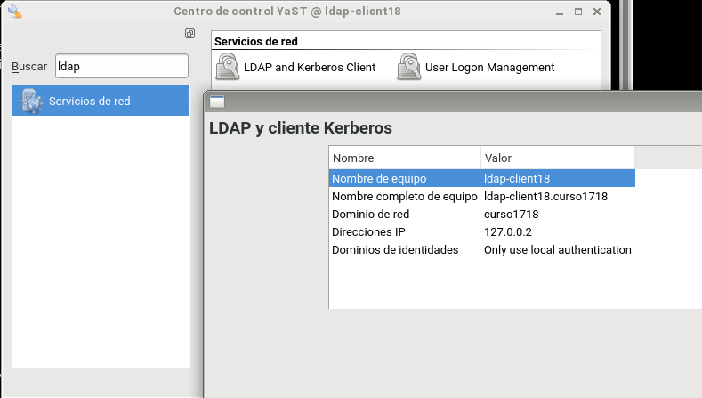
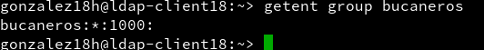

# LDAP    

    

## 1. Servidor.  
### 1.1 Configuración.
Establecemos las nuevas relaciones especificadas en la actividad en los ficheros `/etc/hosts` y en `/etc/hostname`.  
    

    

Instalamos el paquete `yast2-auth-server`.  
   

Desde *yast* entramos a "Servicios de red > Servicios de autenticación" e iniciaremos la configuración de *LDAP*. La configuración a seguir se muestra en las capturas siguientes.  
    

    

    

    

    

    

Revisamos que la configuración se ha realizado como era deseada.  
    

Comprobaciones:  
- slaptest -f /etc/openldap/slapd.conf para comprobar la sintaxis del fichero de configuración.   
   

- systemctl status slapd, para comprobar el estado del servicio.  

- systemctl enable slapd, para activar el servicio automáticamente al reiniciar la máquina.  

- nmap -Pn localhost | grep -P '389|636', para comprobar que el servidor LDAP es accesible desde la red.  
  

- slapcat para comprobar que la base de datos está bien configurada.  
  

- Instalamos la herramienta *GQ* y la lanzamos para poder realizar la siguiente comprobación.  
   

  (lanzamos el servicio con el atributo *&* para que sea independiente de la consola)  
     

- Comprobamos que tenemos creadas las unidades organizativas con *GQ*: groups y people.  

## 1.2 Creación de usuarios y grupos.
Cambiamos el filtro en las pestañas (en cada pestaña) a *Usuarios LDAP* y agregamos el grupo *bucaneros* con los usuiarios *bucanero1* y *bucanero2*.
     

Nos pedirá la contraseña del servidor LDAP para hacer el cambio de filtro.  
   

Aquí estaría el grupo.  
     

Y aquí los usuarios.  
    

Volvemos a comprobar en la herramienta previamente instalada *Qp*.  
     

## 2. Cliente.  
### 2.1 Configuración.
Establecemos las nuevas relaciones especificadas en la actividad en los ficheros `/etc/hosts` y en `/etc/hostname`.  
       

       

Instalamos el paquete *yast2-auth-client*.  
      

Y desde "Yast > LDAP y cliente Kerberos" configuramos la conexión.
     

Quedando algo así.  
     

Finalmente problamos la conexión y nos mostrará el siguiente mensaje.  
     

### 2.2 Comprobaciones.
-`getent passwd bucanero1`  
     

-`getent group bucaneros`  
   

-`id bucanero1`    

-`finger bucanero1`   
  

-`cat /etc/passwd | grep buncaneros`    
-`cat /etc/group | grep bucanero1`  
     

-`su pirata21`  
     

## Anexo: Última comprobación y problema.
Surgió un problema a la hora de reinciar la máquina para realizar la última comprobación dado que esta se quedo congelada en la pantalla de carga del sistema, mostrando múltiples errores.
Se encontró la siguiente solución:
- Usar un CD Live con Knoppix.
- Montamos la unidad afectada haciendo uso del comando *mount*.
- No dirigimos al fichero `/etc/nsswitch.conf` y revisamos que la configuración debe estar como en la captura proporcionada por Kevin.  
    

- Salimos de Knoppix y reiniciamos la máquina. Si todo ha salido bien, la máquina iniciará como siempre.  

Todavía no se conoce la razón exacta por lo que esto ha ocurrido, pero se baraja la hipótesis de que la manera en la que se cierra Yast afecta la actualización de este archivo, dado que a algunos les había funcionado y a otros no.
