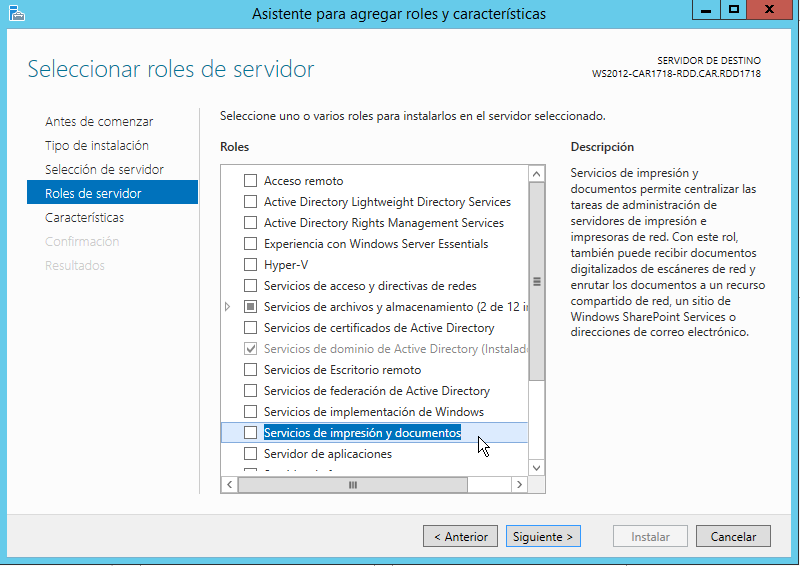
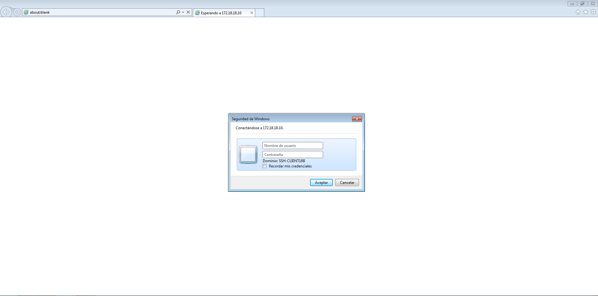

# SERVIDOR DE IMPRESIÓN  
  

## Instalación en Windows Server 2012.  
Comenzamos la práctica en el **Administrador del Servidor** y seleccionamos **Agregar roles y características**.  
    

Le damos a siguiente hasta llegar a la parte de **Seleccionar roles del servidor** y marcamos **Servicios de impresión y documentos**.  
  

Agregamos la característica.  
   

Y comprobamos que se ha agregado.  
    

Aquí nos limitamos a darle a siguiente.  
    

Ahora, debemos asegurarnos de que en **Servicios de Rol**, tanto **Servidor de impresión** como **Impresión en Internet** deben estar activados.  
    

Ticamos la opción para reiniciar el servicio.  
    

Y comenzará el proceso de instalación. Al finzalizar, comprobaremos en esta ventana que todo se ha instalado correctamente.  
    

## PDF Creator.  
Una vez hecha la instalación del servidor de impresión, descargamos **PDF Creator**, quién acturará de "impresora virtual" en esta práctica.  
    

Una vez instalado, vamos a **Perfiles>Guardar** donde activaremos la opción de **guardado automático** y **seleccionamos la ruta** donde se guardarán dichos archivos.
    

Hecho esto, hacemos una simple comprobación imprimiendo un bloc de notas.  
    

Y comprobamos que se genera el documento PDF.  
    

## Compartir impresora de manera local.  
Abrimos **Dispositivos e Impresoras** desde el **Panel de Control** o desde el buscador del inicio. Aquí, encontraremos la impresora de **PDF Creator** (la cual debemos compartir con un cliente) y con el secundario, seleccionamos **Propiedades de impresora**.  
    

En la pestaña de compartir, marcamos **Compartir esta impresora**, **Presentar trabajos de impresion en equipos cliente** y definimos un **nombre** a dicha impresora, en este caso, *PDFcarmelo18*.  
    

Ahora, vamos a un cliente e introducimos la **ip del servidor en el explorador de archivos**. Si todo ha salido bien, se deberá ver algo así.
    

Secundario y seleccionamos **Conectar**.  
    

> Como pequeño parentesis a esta parte, debo comentar que en mi caso me topé con un error de lo más molesto donde la máquina cliente me mostraba este error, denegando todo intento posible de conexión.    
    
Otro error que me encontré fue relacionado con la importación de drivers en la máquina cliente, pero esto se debía a que el servidor que utilizaba era de 32 bits frente a un cliente de 64 bits.  
Finalmente, repetí esta práctica con un **Windows Server 2012** limpio (el que se estaba usando previamente era importado de otra práctica en el que se había instalado y configurado un **servidor IIS**, el cual también es necesario para el funcionamiento de este servidor de impresión) y un cliente W10 más adelante y este error desapareció, dando a pensar que esta posible configuración es la responsable del desecadenamiento de este error.  

Y si no tenemos ningún problema, instalaremos el controlador y se abrirá la **cola de impresión**.  
    

    

    

LLegados aquí, comprobamos haciendo una impresión **desde el cliente** de un bloc de notas.
    

Y comprobamos que en la máquina servidor se ha generado un pdf refente al bloc de notas del cliente.  
      

    

## Compartir impresora en red o remoto.     
Abrimos un navegador e introducimos `http://ip-servidor/printers` y pedirá un usuario-contraseña para acceder al servidor.  
      

    

Vamos propiedades y compiamos el **nombre de red**.
    

Ahora, vamos a **dispositivos e impresoras** y **agregamos una impresora**.  
    

Seleccionamos la segunda opción.  
      

Seleccionamos **La impresora desada no está lista**.  
    

Y pegamos el **nombre de red copiado previamente**.  
    

Pedirá un usuario-contraseña de accceso al servidor.  
    

Le damos a siguiente, filanizamos y comprobamos que se ha agregado correctamente.  
    

    

      

Para comprobar su funcionamiento, paramos la impresora desde el navegador.  
      

Hacemos una petición de impresión desde el **cliente** y volvemos a activar el servidor de impresión.
    

Finalmente, comprobamos que el archivo ha llegado correctamente.  
    

  
