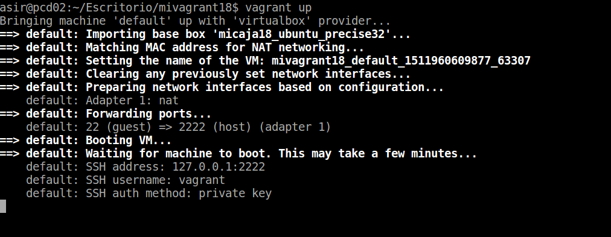

# Vagrant  
    

## 1. Instalación.    
Instalamos Vagrant mediante `apt-get install vagrant` (no se puede mostrar una captura de este paso ya que se hizo en la máquina real).  

Creamos el directorio *mivagrant18* y ejecutamos `vagrant init` para generar el archivo de configuración *Vagrantfile*.  
    

Agregamos la ca caja con `vagrant box add micaja18_ubuntu_precise32.box`.
      

Y comprobamos que se ha agregado la caja con `vagrant box list`.  
    

Eliminamos todos los comentarios, dado que estos no son necesarios y dificultan la lectura del archivo.   
     

Dejando solo la línea de *config.vm.box* como se muestra en la captura.  
    


## 2. Configuración.
Levantamos la máquina con `vagrant up`.  
    

Probamos que se puede establecer una conexión mediante ssh.  
     

Y comprobamos que *Vagrantfile* sigue en el mismo directorio a pesar de estar en un entorno virtual.  
     

Una vez hecho esto, procedemos a intarlar *apache2*.  
    

Redirigimos el puerto en *Vagrantfile* usando `config.vm.network :forwarded_port, host: 4567, guest: 80`, como se muestra en la captura.  
    

Recargamos el servicio de vagrant con `vagrant reload`.  
    

Llegados aquí, realizamos las siguientes comprobaciones:  
- `nmap -p 4500-4600 localhost, debe mostrar 4567/tcp open tram`.  
    
- `netstat -ntap, debe mostrar tcp 0.0.0.0:4567 0.0.0.0:* ESCUCHAR`.  
    

- `172.0.0.1:4567` desde un navegador.  
      

## 3. Suministro - Ejecución de Scripts.  
Paramos la máquina con `vagrant halt`.  
    

Y destruimos la máquina con `vagrant destroy`.   
    


Creamos el script con la siguiente configuración.  
```console
#!/usr/bin/env bash

apt-get update
apt-get install -y apache2
rm -rf /var/www
ln -fs /vagrant /var/www
echo "<h1>Actividad de Vagrant</h1>" > /var/www/index.html
echo "<p>Curso201516</p>" >> /var/www/index.html
echo "<p>Nombre-del-alumno</p>" >> /var/www/index.html
```   
    

Asignamos permisos de ejecución al script.
    

Introducimos `config.vm.provision :shell, :path => "install_apache.sh"` en *Vagrantfile*.  
    

Levantamos la máquina.  
   

Y comrpobamos en un navegador con la misma dirección.  
    

    

### Puppet.    
Volvemos al *Vagrantfile* e introducimos el siguiente código.  
```console
Vagrant.configure(2) do |config|
  ...
  config.vm.provision "puppet" do |puppet|
    puppet.manifest_file = "default.pp"
  end
 end
```  
    

Creamos el directorio *manifest* y dentro el fichero *default.pp* con:  
```console
package { 'nmap':
  ensure => 'present',
}
```
    

    

Recargamos el servicio.
    

Y ejecutamos `vagrant provision` para cargar la nueva configuración.  
    


## 4. Caja personalizada.  
## Máquina Virtual.  
Comprobamos que *openssh* está instalado.  
      

Creamos usuario *vagrant*, con permisos *root*. También modificamos ambas contraseñas (root y normal) a "vagrant".  


Añadiemos también `vagrant ALL=(ALL) NOPASSWD: ALL` al fichero `/etc/sudoers`.  
    

Ejecutamos `wget https://raw.githubusercontent.com/mitchellh/vagrant/master/keys/vagrant.pub -O .ssh/authorized_keys`.  
    

Nos aseguramos de fijar los permisos de *.ssh/* y *authorized_keys* a 700-600 respectivamente.  
    

Antes de salir de la máquina virtutal, comprobamos la versión que esta instalada de *GuestAditions* con `modinfo vboxguest`.  
    

## Máquina Real.   
Creamos el directorio y ejecutamos `vagrant init` para crear el Vagrantfile.  
      

Ejecutamos `VBoxManage list vms` para averiguar el nombre de la máquina que acabamos de configurar.  
    

Una vez localizado, ejecutamos `vagrant package --base ubuntu_vagrant` para crear la caja o fichero *package.box*.  
    

Comprobamos que se ha generado la caja con `vagrant box list`.  
   

    

Cambios en *Vagrantfile* el nombre de la máquina por el actual *ubuntu_vagrant*.  
    

Finalmente, lanzamos `vagrant up` para ejecutar la máquina y la debería de haber conectado. En mi caso, me dio un problema con las claves de ssh que no logré solucionar (se repitió este último paso unas tres veces sin éxito).  
  
