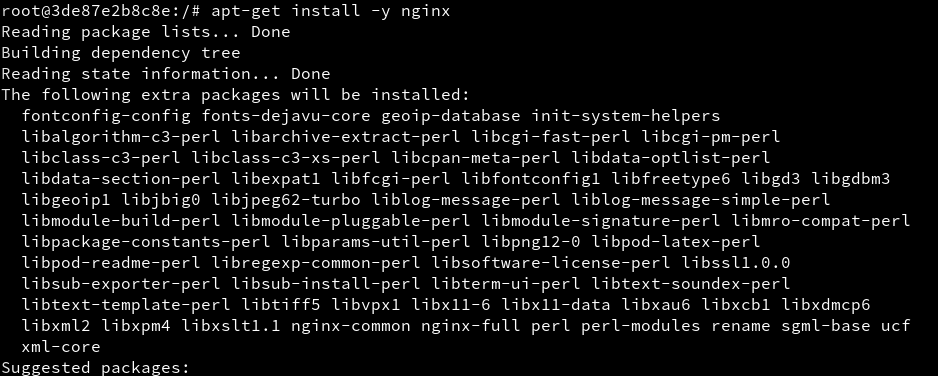
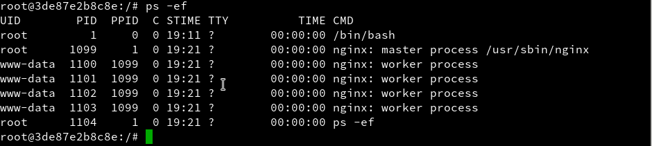
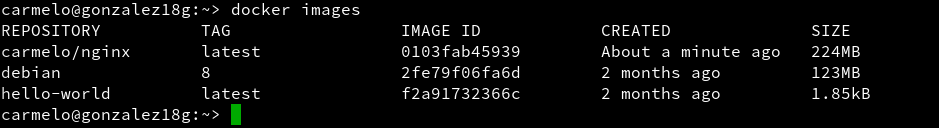

# Docker.


## Comprobación previa.
Comprobamos el kernel con `uname -a` (debe ser 3.10 o superior):    
  

## Instalación.
Seguiremos los siguientes pasos:  

`zypper in docker              --> Instala docker.`    


`systemctl start docker        --> Inicia el servicio / "docker daemon" hace el mismo efecto.`  
  

`docker version                --> Debe mostrar información del cliente y del servidor.`    
   

`usermod -a -G docker USERNAME --> Añade permisos a nuestro usuario.` (Se ha realizado un `id carmelo` para comprobar que esta dentro del grupo *docker*).  
      

```
* Salir de la sesión y volver a entrar con nuestro usuario.
* Ejecutar con nuestro usuario para comprobar que todo funciona:
```    
`docker images         --> Muestra las imágenes descargadas hasta ahora.`  
    

`docker ps -a          --> Muestra todos los contenedores creados.`  
  

`docker run hello-world --> Descarga y ejecuta un contenedor con la imagen hello-world.`  
   

`docker images`  
  

`docker ps -a           --> El contenedor está estado 'Exited'.`  
  


---

## Configuración de la red

**Habilitar el acceso a la red externa a los contenedores**

Si queremos que nuestro contenedor tenga acceso a la red exterior, debemos
activar la opción IP_FORWARD (`net.ipv4.ip_forward`). Lo podemos hacer en YAST.

* Para openSUSE13.2 (cuando el método de configuracion de red es Wicked).
`Yast -> Dispositivos de red -> Encaminamiento -> Habilitar reenvío IPv4`
* Cuando la red está gestionada por Network Manager, en lugar de usar YaST
debemos editar el fichero `/etc/sysconfig/SuSEfirewall2` y poner `FW_ROUTE="yes"`.
* Para openSUSE Tumbleweed `Yast -> Sistema -> Configuración de red -> Menú de encaminamiento`.  

  

Reiniciar el equipo para que se apliquen los cambios.

## Más comandos

Información sobre otros comandos útiles:

* `docker stop CONTAINERID`, parar un contenedor que estaba iniciado.
* `docker start CONTAINERID`, inicia un contenedor que estaba parado.
* `docker attach CONTAINERID`, conecta el terminal actual con el interior de contenedor.
* `docker ps`, muestra los contenedores en ejecución.
* `docker ps -a`, muestra todos los contenedores en ejecución o no.
* `docker rm CONTAINERID`, eliminar un contenedor.
* `docker rmi IMAGENAME`, eliminar una imagen.

---

## Creación manual

Nuestro SO base es OpenSUSE, pero vamos a crear un contenedor Debian8,
y dentro instalaremos Nginx.

## Crear una imagen manualmente
`docker images         --> Vemos las imágenes disponibles localmente.`  
    

`docker search debian   --> Buscamos en los repositorios de Docker Hub.`  


`docker pull debian:8   --> Descargamos una imagen debian:8 en local. `   
   

`docker images  `  
    

`docker ps -a           --> Vemos todos los contenedores.`  
  

`docker ps              --> Vemos sólo los contenedores en ejecución.`  
    

```  

* Vamos a crear un contenedor con nombre `con_debian` a partir de la
imagen `debian:8`, y ejecutaremos `/bin/bash`:

```
`docker run --name=con_debian -i -t debian:8 /bin/bash`  
  

(Estamos dentro del contenedor)  
`root@IDContenedor:/# cat /etc/motd            --> Comprobamos que estamos en Debian.`  
    

`root@IDContenedor:/# apt-get update`  
    

`root@IDContenedor:/# apt-get install -y nginx --> Instalamos nginx en el contenedor.`  
   

`root@IDContenedor:/# apt-get install -y vim   --> Instalamos editor vi en el contenedor.`  
  

`root@IDContenedor:/# /usr/sbin/nginx          --> Iniciamos el servicio nginx.`  


`root@IDContenedor:/# ps -ef`    
    


```
* Creamos un fichero HTML (`holamundo.html`).
```
`root@IDContenedor:/# echo "<p>Hola nombre-del-alumno</p>" > /var/www/html/holamundo.html`  
   

```
* Creamos tambien un script `/root/server.sh` con el siguiente contenido:

#!/bin/bash

echo "Booting Nginx!"
/usr/sbin/nginx &

echo "Waiting..."
while(true) do
  sleep 60
done  
```  
  

  

Ahora con esto podemos crear la nueva imagen a partir de los cambios que realizamos sobre la imagen base:  


`docker commit 7d193d728925 dvarrui/nginx `  


`docker images`    
  


```
> Los estándares de Docker estipulan que los nombres de las imagenes deben
seguir el formato `nombreusuario/nombreimagen`.
> Todo cambio que se haga en la imagen y no se le haga commit se perderá en cuanto se cierre el contenedor.

```
`docker ps`  
  

`docker stop con_debian  --> Paramos el contenedor.`  
     

`docker ps`  
    

`docker ps -a           --> Vemos el contenedor parado.`  
    

`docker rm IDcontenedor --> Eliminamos el contenedor.`  
      

`docker ps -a`  
     

## Crear contenedor con Nginx

Bien, tenemos una imagen con Nginx instalado, probemos ahora la magia de Docker.

Iniciemos el contenedor de la siguiente manera:
```
docker ps
docker ps -a
docker run --name=con_nginx -p 80 -t dvarrui/nginx /root/server.sh
Booting Nginx!
Waiting...
```   
   

  

  

Los mensajes muestran que el script server.sh está en ejecución.
No parar el programa. Es correcto.

> * El argumento `-p 80` le indica a Docker que debe mapear el puerto especificado
del contenedor, en nuestro caso el puerto 80 es el puerto por defecto
sobre el cual se levanta Nginx.
> * El script `server.sh`nos sirve para iniciar el servicio y permanecer en espera.
Lo podemos hacer también con el prgorama `Supervisor`.

Abrimos una nueva terminal.  
`docker ps`, nos muestra los contenedores en ejecución. Podemos apreciar
que la última columna nos indica que el puerto 80 del contenedor está redireccionado a un puerto local `0.0.0.0.:NNNNNN->80/tcp`.    
     

Abrir navegador web y poner URL `0.0.0.0.:NNNNNN`. De esta forma nos conectaremos con el servidor Nginx que se está ejecutando dentro del contenedor.    
     

Comprobamos también que se muestra el fichero *holamundo.html*:  
    

Paramos el contenedor y lo eliminamos.  
`docker ps`  
    

`docker stop con_nginx`  
    

`docker ps`  
    

`docker ps -a`  
  

`docker rm con_nginx`  


`docker ps -a`  
     

> Como ya tenemos una imagen docker, podemos crear nuevos contenedores
cuando lo necesitemos.

---

## Crear un contenedor con `Dockerfile`

Ahora vamos a conseguir el mismo resultado del apartado anterior, pero
usando un fichero de configuración, llamado `Dockerfile`

## Comprobaciones iniciales:

```
docker images
docker ps
docker ps -a
```  
  

     

  


## Preparar ficheros

Creamos el directorio `/home/nombre-alumno/dockerXX`, y ponemos dentro los siguientes ficheros:
    * Dockerfile
    * holamundo.html
    * server.sh    
    


* Crear el fichero `Dockerfile` con el siguiente contenido:  

```
FROM debian:8

MAINTAINER Nombre-del-Alumno 1.0

RUN apt-get update
RUN apt-get install -y apt-utils
RUN apt-get install -y nginx
RUN apt-get install -y vim

COPY holamundo.html /var/www/html
RUN chmod 666 /var/www/html/holamundo.html

COPY server.sh /root
RUN chmod +x /root/server.sh

EXPOSE 80

CMD ["/root/server.sh"]    
```  
  

> Los ficheros `server.sh` y `holamundo.html` que vimos en el apartado anterior,
tienen que estar en el mismo directorio del fichero `Dockerfile`.


## Crear imagen desde el `Dockerfile`

El fichero [Dockerfile](./files/Dockerfile) contiene la información necesaria para contruir el contenedor, veamos:

`cd /home/nombre-del-alumno/dockerXX --> Entramos al directorio del Dockerfile.`  
      

`docker images                       --> Consultamos las imágenes disponibles.`  
    

`docker build -t dvarrui/nginx2 .    --> Construye imagen a partir del Dockefile.`  
      

`docker images                       --> Debe aparecer nuestra nueva imagen.`  
      

## Crear contenedor y comprobar
A continuación vamos a crear un contenedor con el nombre `con_nginx2`,
a partir de la imagen `dvarrui/nginx2`, y queremos que este contenedor
ejecute el programa `/root/server.sh`.  

```
docker run --name=con_nginx2 -p 80 -t dvarrui/nginx2 /root/server.sh
```
Desde otra terminal hacemos `docker ps`, para averiguar el puerto de escucha
del servidor Nginx.
  

  

Comprobamos en el navegador URL:   
  

Comprobamos en el navegador URL:   
  

---

# Migrar las imágenes de docker a otro servidor

¿Cómo puedo llevar los contenedores docker a un nuevo servidor?

> Enlaces de interés
>
> * https://www.odooargentina.com/forum/ayuda-1/question/migrar-todo-a-otro-servidor-imagenes-docker-397
> * http://linoxide.com/linux-how-to/backup-restore-migrate-containers-docker/

Creamos una imagen de contenedor:
`docker ps`
  

`docker commit -p CONTAINERID containerXX-backup` grabamos una imagen de nombre "containerXX-backup" a partir del contenedor CONTAINERID.  
  

`docker images`comprobamos que se ha creado la imagen "container-backup".  
  

Exportamos una imagen docker a fichero:
`docker save -o ~/containerXX-backup.tar containerXX-backup`, guardamos la imagen
"container-backup" en un fichero tar.  
  

Importar imagen docker desde fichero:
Nos llevamos el tar a otra máquina con docker instalado, y restauramos.  

`docker load -i ~/containerXX-backup.tar`, cargamos la imagen docker a partir del fichero tar.  
  

`docker images`, comprobamos que la nueva imagen está disponible.    
      
