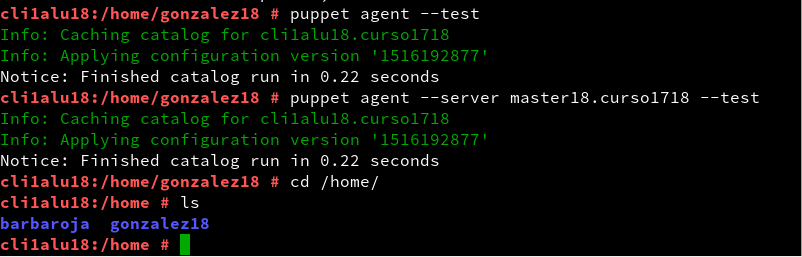
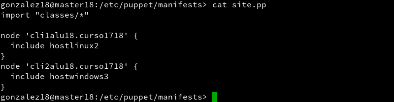
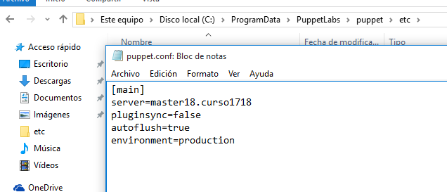

# Puppet.  
    

## 1. Open Suse.
### 1.1 Instalación y configuración del Master.  
Comenzamos la instalación de *Puppet* con ``sudo zypper install rubygem-puppet-master``.  
    

Comprobamos el estado del servicio con ``systemctl status puppetmaster.service``.  
     

Visto esto, lo activamos en el arranque con las opciones de *enable*, lo iniciamos con *start* y volvemos a comprobar su estado.  
    

Comprobamos que se han creado los directorios de *Puppet*.  
      

Y creamos los archivos requeridos por la práctica:   
```
mkdir /etc/puppet/files
touch /etc/puppet/files/readme.txt
mkdir /etc/puppet/manifests
touch /etc/puppet/manifests/site.pp
mkdir /etc/puppet/manifests/classes
touch /etc/puppet/manifests/classes/hostlinux1.pp
```    
    

Quedando los directorios con esta organización.  
     

En *site.pp* depositamos la siguiente configuración:  
```
import "classes/*"

node default {
  include hostlinux1
}
```   
      

Y en *hostlinux1*:  
```
class hostlinux1 {
  package { "tree": ensure => installed }
  package { "traceroute": ensure => installed }
  package { "geany": ensure => installed }
}  
```  
    

Antes de pasar al *Cliente1*, comprobamos que el directorio ``/var/lib/puppet`` tienen a *puppet* como usuario-grupo y que el servicio este funcionando de forma correcta.  
      

``systemctl status puppetmaster``
    

``netstat -ntap |grep ruby``
     

``tail /var/log/puppet/*.log``
    

Y añadimos una exepción en el *firewall*.  
    

  

### 1.2 Instalación y configuración del Cliente1.    
Instalamos con ``sudo zypper install rubygen-puppet``.  
    

Añadimos las siguientes líneas a ``/etc/puppet/puppet.conf``:  
```[main]
# Definir el host master puppet
server=master18.curso1718
...
[agent]
...
# Desactivar los plugin para este agente
pluginsync=false
```  
    

Comprobamos que el directorio ``/var/lib/puppet`` tiene como usuario-grupo a *puppet*, el estado del servicio, arrancar y habilitar en el arranque y los servicios de los puertos.  
    

    

   

    

## 1.3 Certificados.  
Volvemos al master como root, lanzamos `puppet cert list` y podremos ver que el certificado del *Cliente1* aparece.  
    

Lo aceptamos con `puppet cert sign "cli1alu18.curso1718"`.  
    

Hecho esto, habrá desaparecido de la lista principal y se habrá registrado en la máquna máster.  
    

Reiniciamos y comprobamos el estado para comprobar que se ha realizado correctamente.  
    

---
Vamos al cliente y comprobamos con `puppet agent --test`.  
    

Y con `puppet agent --server master18.curso1718 --test`.  
    

No existe fichero de log, por lo tanto, no ha sucedido ninguno.  
    

## 1.4 Segundo fichero pp.  
Creamos un fichero *hostlinux2* dentro de la ruta `/etc/puppet/manifests/classes`.  
  

Con el siguiente contenido:  
```
class hostlinux2 {
  package { "tree": ensure => installed }
  package { "traceroute": ensure => installed }
  package { "geany": ensure => installed }

  group { "piratas": ensure => "present", }
  group { "admin": ensure => "present", }

  user { 'barbaroja':
    home => '/home/barbaroja',
    shell => '/bin/bash',
    password => 'poner-una-clave-encriptada',
    groups => ['piratas','admin','root']
  }

  file { "/home/barbaroja":
    ensure => "directory",
    owner => "barbaroja",
    group => "piratas",
    mode => 750
  }

  file { "/home/barbaroja/share":
    ensure => "directory",
    owner => "barbaroja",
    group => "piratas",
    mode => 750
  }

  file { "/home/barbaroja/share/private":
    ensure => "directory",
    owner => "barbaroja",
    group => "piratas",
    mode => 700
  }

  file { "/home/barbaroja/share/public":
    ensure => "directory",
    owner => "barbaroja",
    group => "piratas",
    mode => 755
  }
}
```     
      

Y *site.pp* :  
```  
import "classes/*"

node default {
  include hostlinux2
}
```  
      

Reiniciamos y comprobamos el estado.  
    

En el *Cliente1* comprobamos los nuevos cambios. (Esta captura esta incorrecta, dado que bastaba con un simple reinicio del servicio para forzar la nueva configuración.).
    

## 2. Windows.  
### 2.1 Master.  
En el *master* creamos el fichero *hostwindows3.pp*.  
    

Con la siguiente configuración:  
```
class hostwindows3 {
  file {'C:\warning.txt':
    ensure => 'present',
    content => "Hola Mundo Puppet!",
  }
}  
```  
    

Y *site.pp* :  
```
import "classes/*"

node 'cli1alu42.curso1617' {
  include hostlinux2
}

node 'cli2alu18' {
  include hostwindows3
}
```  
    

Reiniciamos y comprobamos el estado del servicio.  
    

Por último, con el comando ``facter`` comprobamos la versión instalada de *Puppet*, necesario para escoger el archivo de instalación correcto en Windows.  
    

### 2.2 Cliente 2.  
Descargamos la versión deseada desde https://downloads.puppetlabs.com/windows/ e instalamos.  
    

Una vez instalado, nos dirigimos a `C:\ProgramData\PuppetLabs\puppet\etc\puppet.conf` y lo dejamos de la siguiente manera:  
```
[main]
server=masterXX.curso1718 # Definir el host master
pluginsync=false          # Desactivar los plugin
```  
  

Reiniciamos la máquina y ejecutamos el *agente de puppet* que generará el certificado.  
     

Vamos al master y ejecutamos `puppet cert --list`, donde aparecerá el certificado del cliente si todo ha salido bien.  
      

Aceptamos el certificado con `puppet cert sign "cli2alu18"` y reiniciamos el servicios.     
     

Volvemos al cliente y ejeuctamos `puppet agent --configprint server` que nos deberá dar la salida *master18.curso1718*.  
     

Ejecutamos `puppet agent --server master18.curso1718 --test` para cargar la configuración desde el master.    
     

Comprobamos el estado de agente con `puppet agent -t --debug --verbose`.  
     

     

`facter` Para ver la versión alctual del *agente puppet*.  
     

     

Vemos la configuración actual del usuario con `puppet resource user carmelo-w10rdd`.  
     

Y finalmente `puppet resource file c:\Users:` para ver la configuración puppet de la carpeta.  
   

## 3. Hostwindows4.pp .
Probamos la nueva configuración con un nuevo fichero.  
  

Sincronizamos.  
     

Ha funcionado.  
     


## 4. Hostwindows5.pp .
Repetimos los pasos anteriores, pero esta vez se deberá crear un usuario, un fichero y un directorio.
       

Forzamos el la configuración.
    

Se ha creado el directorio, el fichero...  
     

Y el usuario.  
     

# Anexo: Problema y solución.
La primera vez que intenté sincronizar la configuración de *puppet*, esta no paraba de fallar. Aparecía el certificado y lo firmarba.  
    

      

Pero a la hora de realizar el test, salía el siguiente error.
     
Usé los comandos sugeridos en la consola, pero ninguno de ellos surtió efecto, a pesar de hacer varios reincios, desactivar firewall etc...  

Como última opción disponible, fui a la ruta de `C:\Usuarios\carmelo-w10rdd\puppet\ssl\certs` donde pude ver que los "en teoría eliminados certificados" todavía seguían ahí, a pesar de haber utilizado los comandos sugeridos y la documentación de *puppet*. Los borré manualmente.
  

Reinicié la máquina y por fin todo volvió a la normalidad.  
    
