# TAREAS PROGRAMADAS.  

  

## 1. Windows.  
### 1.1 Tarea diferida.  
Accedemos al *Asistente para crear tareas básicas* desde `Panel de control -> Herramientas administrativas -> Programador de tareas` y configuramos una tarea con la siguiente configuración.  
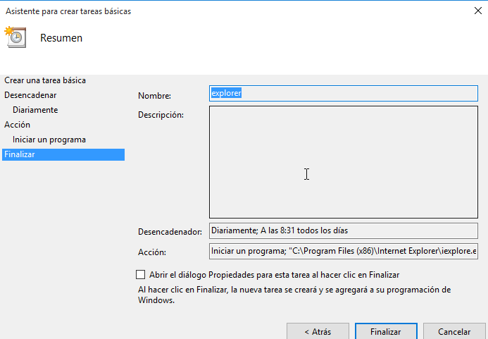    

Comprobamos que se ha generado.  
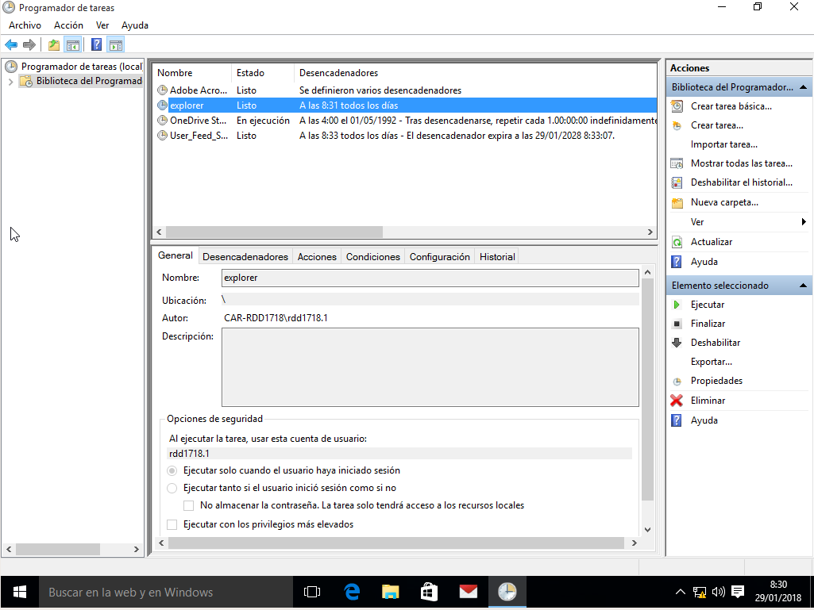    

Esperamos un poco y se debería de abrir el *Internet Explorer*.  
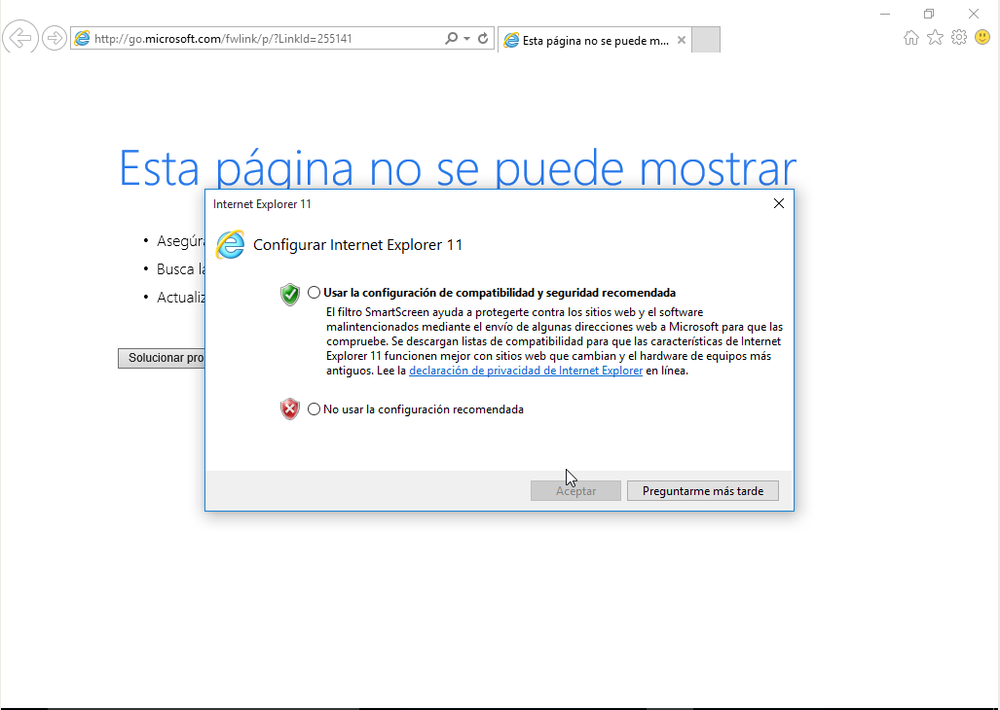    

### 1.2 Tarea periódica.  
Seleccionamos en esta ocasión *Crea tarea...*, donde se nos deplegará un menú con varias pestañas donde podremos espeficiar la hora, el nombre y los desencadenadores. En esta práctica, se carga el script de *shutdown* localizado en `C:\Windows\System32\shutdown.exe` con el argumento *-s* que apagará el equipo.  
    

Aquí podemos revisar su configuración.  
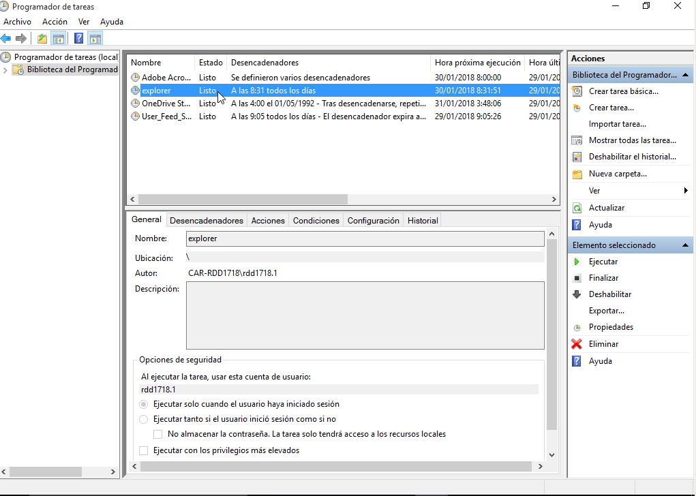    

Funcionó.  
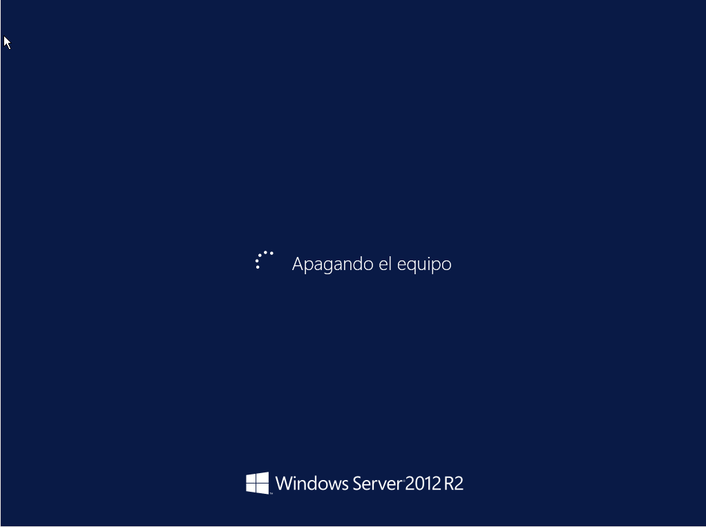    

## 2. OpenSuse.  
### 2.1 Tarea diferida.  
Comprobamos el estado del servicio *atd*, lo iniciamos, lo habilitamos en el arranque y lo volvemos a comprobar.  
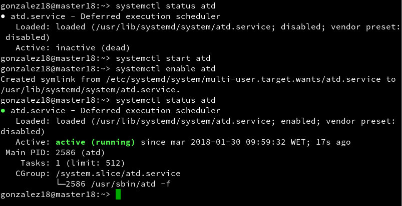    

Comprobamos que no hay ninguna tarea con el comando `atq`.  
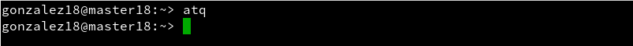    

Generamos un script con el siguiente contenido:  
```
#!/bin/sh
# Mostrar mensaje en pantalla
DISPLAY=:0
export DISPLAY
zenity --info --text="¡Hola nombre-del-alumno!"
```  
Y con el comando `at 11:08 Jan 30 < script.sh` establecemos la fecha de ejecucíon para dicho script.  
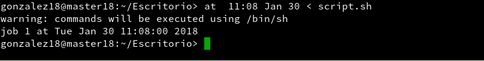    

Comprobamos que se ha generado.  
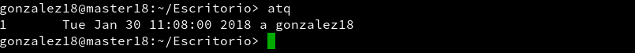    

Ha funcionado.  
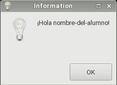    

### 2.2 Tarea periódica.  
Para este tipo de tarea, utilizaremos *crontab*. Si usamos `crontab -l` podremos ver las tareas activas.  
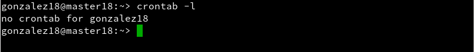    

Con el usuario *root*, ejecutamos `crontab -e` para grabar el comando de la tarea que queremos que se ejecute, donde *24* serían los min, *10* la hora, días, meses y años consecutivamente. Si queremos que el editor sea nano habrá que ejecutar `export VISUAL='nano'`.  
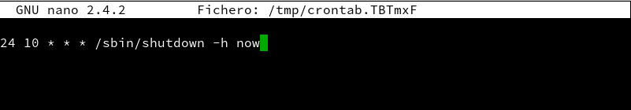    

Comprobamos que se ha guardado con `crontab -l` y el equipo se apagará en la fecha especificada.  
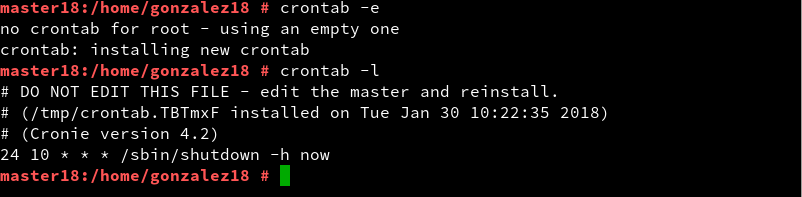  
