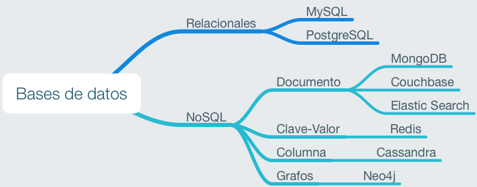
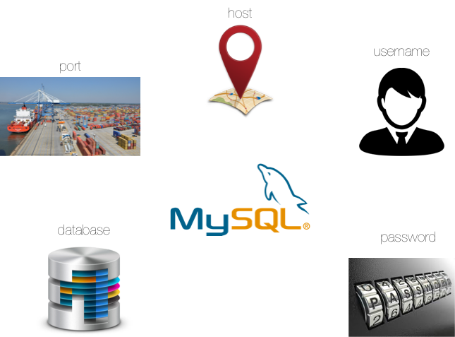

## Tipos de bases de datos

Existen multitud de tipos de bases de datos. Aquí un esquema con las más relevantes:



## Instalación de MySQL en la máquina de desarrollo

En su momento instalamos [el sistema gestor de bases de datos `MySQL`](https://github.com/sdelquin/claseando/blob/master/imw/UT1/notes/database/README.md) para la máquina de producción.

Tendremos que seguir los mismos pasos para instalarlo en la máquina de desarrollo. No es necesario que realices la instalación segura. Aunque es recomendable, estamos en desarrollo, y en teoría, la máquina no está tan expuesta.

Recuerda el password de `root` que le asignaste al servidor *MySQL*.

## MySQL y Python

El módulo que vamos a usar para conectar *Python* con bases de datos *MySQL* es [PyMySQL](https://github.com/PyMySQL/PyMySQL).

Para instalar dicho módulo habrá que ejecutar el siguiente comando, teniendo nuestro entorno virtual activo:

```console
(sandbox) sdelquin@imw:~/sandbox$ pip install pymysql
Collecting pymysql
  Downloading PyMySQL-0.8.0-py2.py3-none-any.whl (83kB)
    100% |████████████████████████████████| 92kB 1.1MB/s
Installing collected packages: pymysql
Successfully installed pymysql-0.8.0
(sandbox) sdelquin@imw:~/sandbox$
```

### ¿Qué datos necesito para acceder a MySQL?



## Supuesto práctico: "Mis comandos"

El supuesto práctico consiste en desarrollar una aplicación para leer por consola comandos unix, e irlos guardando en una base de datos *MySQL*. Cada comando consiste en el comando y su descripción.

### Setup de la base de datos

```sql
sdelquin@imw:~$ mysql -u root -p
Enter password:
Welcome to the MySQL monitor.  Commands end with ; or \g.
Your MySQL connection id is 5
Server version: 5.7.20-0ubuntu0.16.04.1 (Ubuntu)

Copyright (c) 2000, 2017, Oracle and/or its affiliates. All rights reserved.

Oracle is a registered trademark of Oracle Corporation and/or its
affiliates. Other names may be trademarks of their respective
owners.

Type 'help;' or '\h' for help. Type '\c' to clear the current input statement.

mysql>
```

Vamos a realizar las siguientes acciones:
- Crear una base de datos denominada `commands`.
- Crear un usuario `aragorn` con contraseña `arazorn`.
- Conceder todos los permisos posibles a `aragorn` sobre `commands`.
- Crear una tabla `commands`.

```sql
mysql> create database commands;
Query OK, 1 row affected (0,00 sec)

mysql> create user aragorn@localhost identified by 'arazorn';
Query OK, 0 rows affected (0,01 sec)

mysql> grant all privileges on commands.* to aragorn@localhost;
Query OK, 0 rows affected (0,00 sec)

mysql> use commands;
Database changed

mysql> create table commands (name varchar(256) not null, description varchar(512), primary key (name));
Query OK, 0 rows affected (0,02 sec)
```

### Código

Creamos un fichero `main.py`:

```python
import pymysql.cursors

# Connect to the database
connection = pymysql.connect(
    host="localhost",
    port=3306,
    user="aragorn",
    password="arazorn",
    db="commands",
    charset="utf8mb4",
    cursorclass=pymysql.cursors.DictCursor,
    autocommit=True
)

cmd = input("Introduzca el comando: ")
desc = input("Introduzca la descripción: ")

with connection.cursor() as cursor:
    sql = "insert into commands values ('{}', '{}')".format(cmd, desc)
    cursor.execute(sql)

with connection.cursor() as cursor:
    sql = "select * from commands order by name"
    cursor.execute(sql)
    result = cursor.fetchall()
    print(result)
```

Si ejecutamos este código tenemos lo siguiente:

```console
(sandbox) sdelquin@imw:~/sandbox$ python main.py
Introduzca el comando: ls
Introduzca la descripción: Listar el contenido de un directorio
[{'name': 'ls', 'description': 'Listar el contenido de un directorio'}]
(sandbox) sdelquin@imw:~/sandbox$ python main.py
Introduzca el comando: cd
Introduzca la descripción: Cambiar a otro directorio
[{'name': 'cd', 'description': 'Cambiar a otro directorio'}, {'name': 'ls', 'description': 'Listar el contenido de un directorio'}]
(sandbox) sdelquin@imw:~/sandbox$
```

### Reorganizando el código

Vamos a dividir el fichero `main.py` en dos:

```console
(sandbox) sdelquin@imw:~/sandbox$ tree
.
├── main.py
└── mysql.py

0 directories, 2 files
(sandbox) sdelquin@imw:~/sandbox$
```

En el fichero `mysql.py` creamos una clase llamada `DB` para empaquetar los métodos que necesitamos de acceso a base de datos:

~~~python
import pymysql.cursors


class DB():
    def __init__(self, username, password, database):
        self.connection = pymysql.connect(
            host="localhost",
            port=3306,
            user=username,
            password=password,
            db=database,
            charset="utf8mb4",
            cursorclass=pymysql.cursors.DictCursor,
            autocommit=True
        )

    def run(self, sql):
        with self.connection.cursor() as cursor:
            cursor.execute(sql)
            if sql.startswith("select"):
                return cursor.fetchall()
~~~

En el fichero `main.py` quedaría el resto de la aplicación:

```python
from mysql import DB

db = DB("aragorn", "arazorn", "commands")

cmd = input("Introduzca el comando: ")
desc = input("Introduzca la descripción: ")

sql = "insert into commands values ('{}', '{}')".format(cmd, desc)
db.run(sql)

sql = "select * from commands order by name"
print(db.run(sql))
```

Si probamos a ejecutar:

```console
(sandbox) sdelquin@imw:~/sandbox$ python main.py
Introduzca el comando: rm
Introduzca la descripción: Borra archivos y/o directorios
[{'name': 'cd', 'description': 'Cambiar a otro directorio'}, {'name': 'ls', 'description': 'Listar el contenido de un directorio'}, {'name': 'rm', 'description': 'Borra archivos y/o directorios'}]
(sandbox) sdelquin@imw:~/sandbox$
```
