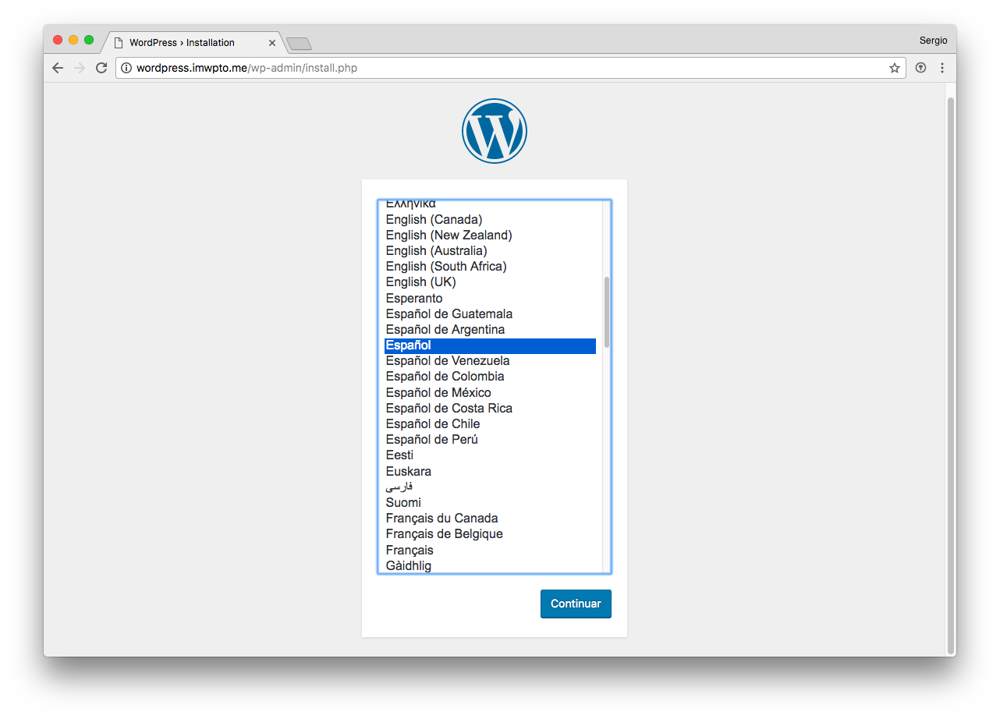
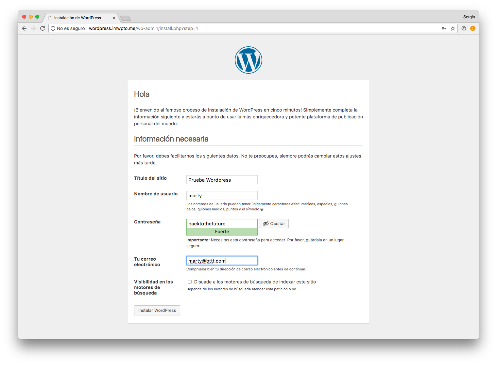
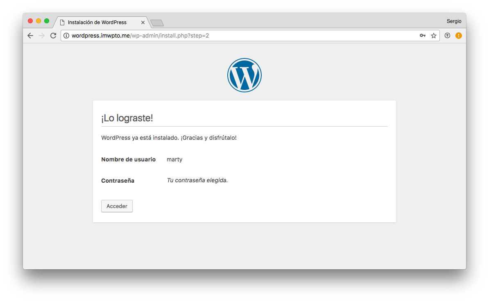
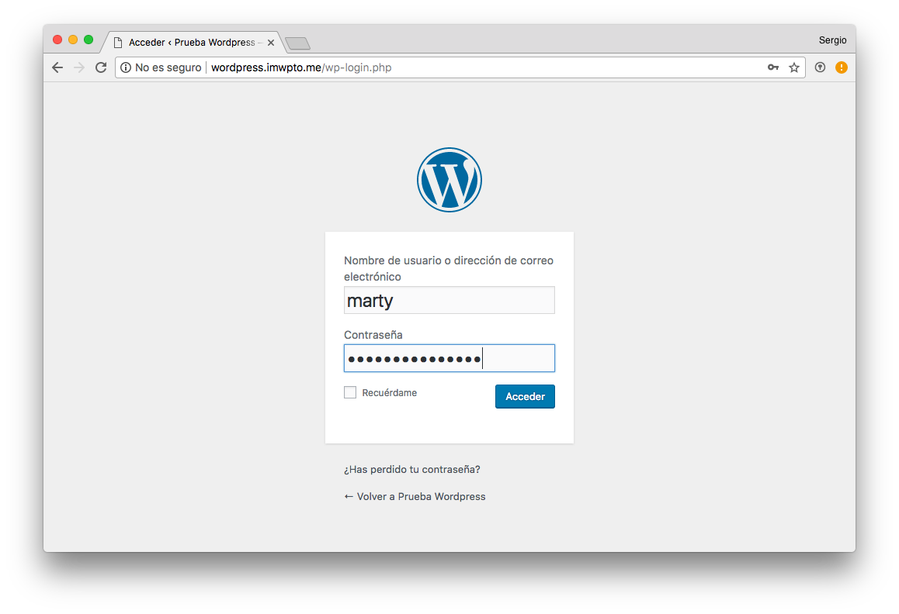
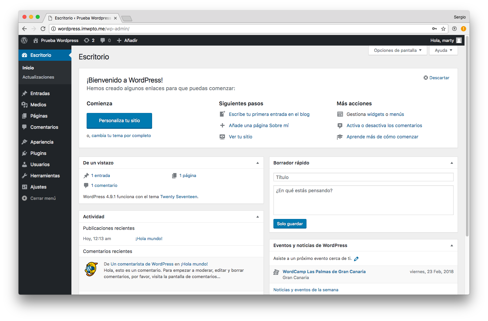

## ¿Por qué Wordpress?

1. Tiene 15 años (se lanzó en 2003).
2. 423,759 líneas de código.
3. 58.55% del mercado de CMS.
4. 27% de páginas de internet están hechas con Wordpress ~ 75M sitios.
5. Wordpress 4.7 se ha descargado casi 20M de veces.
6. Contando todas las versiones, acumula casi 200M de descargas.
7. Wordpress está disponible en más de 50 idiomas.
8. El 14.7% de los 100 sitios web más influyentes del mundo están hechos en Wordpress.
9. `wordpress.com` tiene 175M de páginas vistas al mes.
10. Los usuarios de Wordpress publican 41.7M de nuevos posts cada mes.
11. En 2016, Wordpress publicó 117,939,148,357 palabras.
12. Wordpress supera los 5000 commits por más de 70 contribuidores.
13. Existen más de 3000 temas con licencia GPL.
14. Wordpress se puede instalar en menos de 5 minutos.
15. Hay más de 48500 plugins gratuitos para Wordpress.
16. Alrededor del 40% de las tiendas online usan Wordpress.
17. Jetpack fue instalado el último año en más de 2M de nuevos sitios Wordpress.
18. Akismet bloqueó 80B de comentarios spam.
19. Wordpress "sólo" tiene 532 empleados.

> Fuente: [WhoIsHostingThis](https://www.whoishostingthis.com/compare/wordpress/stats/)

## Instalación de Wordpress

A continuación vamos a instalar un sitio web Wordpress en nuestra máquina de producción. Para ello accedemos a la máquina de producción vía `ssh`:

~~~console
sdelquin@imw:~$ ssh cloud
Welcome to Ubuntu 16.04.3 LTS (GNU/Linux 4.4.0-96-generic x86_64)

 * Documentation:  https://help.ubuntu.com
 * Management:     https://landscape.canonical.com
 * Support:        https://ubuntu.com/advantage

  Get cloud support with Ubuntu Advantage Cloud Guest:
    http://www.ubuntu.com/business/services/cloud

Pueden actualizarse 105 paquetes.
0 actualizaciones son de seguridad.

*** Es necesario reiniciar el sistema ***
Last login: Fri Dec 15 13:33:29 2017 from 81.32.13.218
sdelquin@cloud:~$
~~~

## Estructura de la base de datos

El diagrama *Entidad-Relación* de la base de datos de Wordpress 4.4.2 es el siguiente:

## Configuración de la base de datos

*Wordpress* necesita un usuario/contraseña para acceder a una base de datos. Para ello, usaremos el intérprete de *MySQL*:

~~~console
sdelquin@cloud:~$ mysql -u root -p
Enter password:
Welcome to the MySQL monitor.  Commands end with ; or \g.
Your MySQL connection id is 168
Server version: 5.7.20-0ubuntu0.16.04.1 (Ubuntu)

Copyright (c) 2000, 2017, Oracle and/or its affiliates. All rights reserved.

Oracle is a registered trademark of Oracle Corporation and/or its
affiliates. Other names may be trademarks of their respective
owners.

Type 'help;' or '\h' for help. Type '\c' to clear the current input statement.

mysql>
~~~

Tenemos que crear la base de datos, el usuario y asignar privilegios:

~~~sql
mysql> create database wpdatabase;
Query OK, 1 row affected (0.00 sec)

mysql> create user wpuser@localhost identified by 'Testing_1234';
Query OK, 0 rows affected (0.01 sec)

mysql> grant all privileges on wpdatabase.* to wpuser@localhost;
Query OK, 0 rows affected (0.00 sec)

mysql> exit;
Bye
~~~

## Descarga de código

Descargamos el código fuente de *Wordpress* desde su página web:

~~~console
sdelquin@cloud:~$ cd /tmp/
sdelquin@cloud:/tmp$ curl -O https://wordpress.org/latest.zip
  % Total    % Received % Xferd  Average Speed   Time    Time     Time  Current
                                 Dload  Upload   Total   Spent    Left  Speed
100  9.9M  100  9.9M    0     0  2819k      0  0:00:03  0:00:03 --:--:-- 2819k
sdelquin@cloud:/tmp$ ls -l latest.zip
-rw-rw-r-- 1 sdelquin sdelquin 10406414 ene 12 23:56 latest.zip
sdelquin@cloud:/tmp$
~~~

A continuación descomprimimos el código y lo copiamos en `/usr/share`:

~~~console
sdelquin@cloud:/tmp$ unzip latest.zip
...
...
...
sdelquin@cloud:/tmp$ sudo cp -r wordpress /usr/share/
[sudo] password for sdelquin:
sdelquin@cloud:/tmp$ ls -ld /usr/share/wordpress/
drwxr-xr-x 5 root root 4096 ene 12 23:59 /usr/share/wordpress/
sdelquin@cloud:/tmp$
~~~

Ahora tenemos que establecer los permisos necesarios para que el usuario web `www-data` pueda usar estos ficheros:

~~~console
sdelquin@cloud:/tmp$ sudo chown -R www-data:www-data /usr/share/wordpress/
sdelquin@cloud:/tmp$
~~~

## Editar ficheros de configuración

Básicamente, debemos especificar el nombre de la base de datos, el usuario y la contraseña, para que *Wordpress* pueda usarlos:

~~~console
sdelquin@cloud:/tmp$ cd /usr/share/wordpress/
sdelquin@cloud:/usr/share/wordpress$ sudo cp wp-config-sample.php wp-config.php
sdelquin@cloud:/usr/share/wordpress$ sudo vi wp-config.php
~~~

> Contenido

~~~php
...
// ** MySQL settings - You can get this info from your web host ** //
/** The name of the database for WordPress */
define('DB_NAME', 'wpdatabase');

/** MySQL database username */
define('DB_USER', 'wpuser');

/** MySQL database password */
define('DB_PASSWORD', 'Testing_1234');

/** Database Charset to use in creating database tables. */
define('DB_CHARSET', 'utf8mb4');
...
~~~

## Acceso mediante Nginx

Para que nuestro sitio *Wordpress* sea accesible desde un navegador web, debemos incluir las directivas necesarias en la configuración del servidor web *Nginx*.

Supongamos que queremos acceder a nuestro *Wordpress* desde la url `wordpress.imwpto.me`. Para ello tendremos que crear un nuevo *virtual host* de la siguiente manera:

~~~console
sdelquin@cloud:~$ sudo vi /etc/nginx/sites-available/wordpress
~~~

> Contenido

~~~nginx
server {
    server_name wordpress.imwpto.me;
    index index.php;
    root /usr/share/wordpress;
    location ~ \.php$ {
        include snippets/fastcgi-php.conf;
        fastcgi_pass unix:/run/php/php7.0-fpm.sock;
    }
}
~~~

Enlazamos la configuración para que el *virtual host* esté disponible:

~~~console
sdelquin@cloud:~$ sudo ln -s /etc/nginx/sites-available/wordpress /etc/nginx/sites-enabled/
sdelquin@cloud:~$ ls -l /etc/nginx/sites-enabled/wordpress
lrwxrwxrwx 1 root root 36 ene 13 00:07 /etc/nginx/sites-enabled/wordpress -> /etc/nginx/sites-available/wordpress
sdelquin@cloud:~$
~~~

Recargamos el servidor web *Nginx* para que los cambios sean efectivos:

~~~console
sdelquin@cloud:~$ sudo systemctl reload nginx
sdelquin@cloud:~$
~~~

## Configuración del sitio vía web

Ahora podemos acceder a la dirección de nuestro servidor para configurar nuestro *Wordpress* vía web.

Cuando accedemos a `http://wordpress.imwpto.me` nos redirige a `http://wordpress.imwpto.me/wp-admin/install.php`:

Elegimos el idioma *Español* y le damos a <kbd>Continuar</kbd>:

Rellenamos los campos que nos piden y pulsamos <kbd>Instalar Wordpress</kbd>:

Pulsamos en el botón <kbd>Acceder</kbd> e ingresamos nuestras credenciales:

Así habremos podido acceder a la interfaz administrativa de Wordpress:

## Ajuste de permalinks

En primer lugar activamos esta opción dentro de la interfaz administrativa de Wordpress:

 

Seleccionamos el ajuste **Día y nombre**. Pulsamos en <kbd>Guardar cambios</kbd>.

 

Ahora debemos indicar a Nginx que procese estas URLs:

~~~console
sdelquin@cloud:~$ sudo vi /etc/nginx/sites-available/wordpress
~~~

> Añadir lo siguiente:

~~~nginx
location / {
    try_files $uri $uri/ /index.php?$args;
}
~~~

No olvidarnos de recargar la configuración de Nginx:

~~~console
sdelquin@cloud:~$ sudo systemctl reload nginx
sdelquin@cloud:~$
~~~

Una ventaja que tiene este método es que podemos acceder a la **zona administrativa** utilizando la siguiente URL: `http://wordpress.imwpto.me/admin`

## Límite de tamaño en la subida de archivos

Por defecto, el límite de subida de archivos para aplicaciones *PHP* suele ser bastante bajo, en torno a los 2MB.

Para incrementarlo, debemos hacer lo siguiente, como *root* en la máquina de producción:

~~~console
sdelquin@cloud:~$ sudo vi /etc/php/7.0/fpm/php.ini
~~~

Buscar y modificar sólo las siguientes líneas...

> Contenido:
~~~ini
upload_max_filesize = 64M
post_max_size = 64M
max_execution_time = 300
~~~

Ahora reinciamos el servicio `php-fpm`:

~~~
sdelquin@cloud:~$ sudo systemctl restart php7.0-fpm.service
sdelquin@cloud:~$
~~~

Además de esto, debemos añadir una línea en el fichero de configuración de *Nginx*:

~~~console
sdelquin@cloud:~$ sudo vi /etc/nginx/nginx.conf
~~~

> Contenido:
~~~nginx
http {
    ...
    client_max_body_size 64M;
    ...
}
~~~

A continuación reiniciamos el servidor web *Nginx* para que tengan efectos los cambios realizados en el fichero de configuración:

~~~console
sdelquin@cloud:~$ sudo systemctl reload nginx
sdelquin@cloud:~$
~~~

## Seguridad

- Crear contraseñas complicadas (más de 8 caracteres con letras, números y signos de puntuación.).
- No utilizar el nombre de usuario "Admin".
- Limitar los intentos de login fallidos (plugin [Limit Login Attempts](https://wordpress.org/extend/plugins/limit-login-attempts/)).
- Controlar el *spam* (plugin [Akismet](http://wordpress.org/plugins/akismet/))
- No instalar muchos plugins.
- Buscar código malicioso en los archivos de tu *theme*.
- Añadir un firewall.
- Hacer un backup de la instalación periódicamente (plugin [Updraft Plus](http://wordpress.org/plugins/updraftplus/)).
- Mantener actualizados themes, plugins y software de Wordpress.
- Usar un plugin como [iThemes Security](https://wordpress.org/plugins/better-wp-security/).

## Estructura de ficheros

~~~console
sdelquin@cloud:~$ cd /usr/share/wordpress/wp-content/
sdelquin@cloud:/usr/share/wordpress/wp-content$ tree -d
.
├── languages
│   ├── plugins
│   └── themes
├── plugins
│   └── akismet
│       ├── _inc
│       │   └── img
│       └── views
├── themes
│   ├── twentyfifteen
│   │   ├── css
│   │   ├── genericons
│   │   ├── inc
│   │   └── js
│   ├── twentyseventeen
│   │   ├── assets
│   │   │   ├── css
│   │   │   ├── images
│   │   │   └── js
│   │   ├── inc
│   │   └── template-parts
│   │       ├── footer
│   │       ├── header
│   │       ├── navigation
│   │       ├── page
│   │       └── post
│   └── twentysixteen
│       ├── css
│       ├── genericons
│       ├── inc
│       ├── js
│       └── template-parts
└── upgrade

33 directories
sdelquin@cloud:/usr/share/wordpress/wp-content$
~~~
