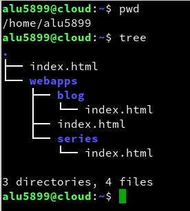
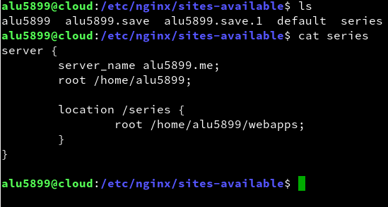
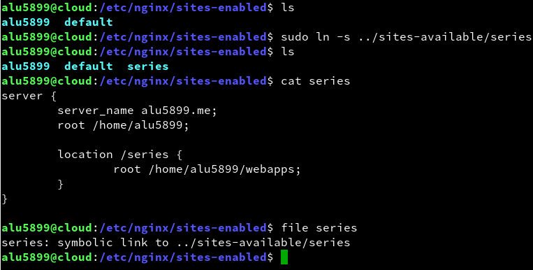
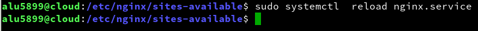
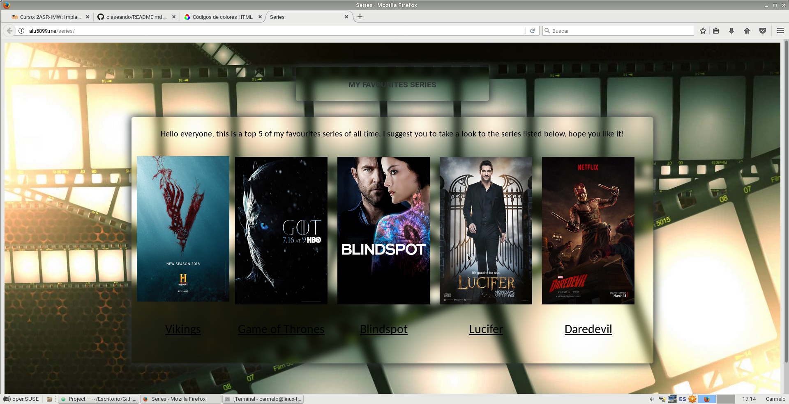

# 1. ACTIVIDAD SERIES / VIRTUAL HOST

## 1.1 PROCESO
Creamos los directorios y archivos necesarios que se van a cagar en la web. Debo añadir
que más tarde decidí darle estilo con *CSS* y cree una nueva carpeta llamada CSS a nivel de *index.html*.

   

 
Nos dirigimos a *sites-available* para crear el archivo de configuración del servidor web *series*. Quedaría de la siguiente manera.

  
 
Ahora nos dirigiremos a *sites-enabled* donde tendremos que crear un enlace simbólico al archivo de configuración en cuestión. Sin esto no se podrá acceder a los archivos de la web.

  
 
Reiniciamos el servicio para cargar los nuevos cambios.
  
## 2. WEB
Y este sería el resultado final de la página web.

> Link: http://alu5899.me/series/
