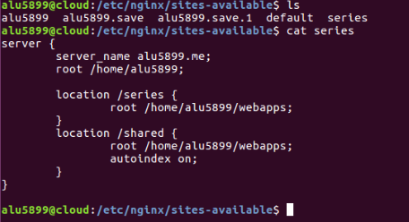
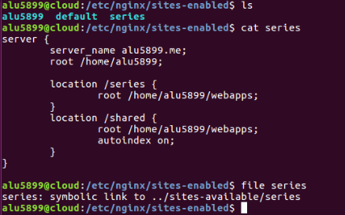
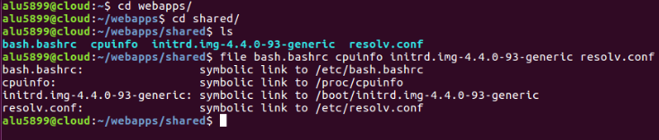
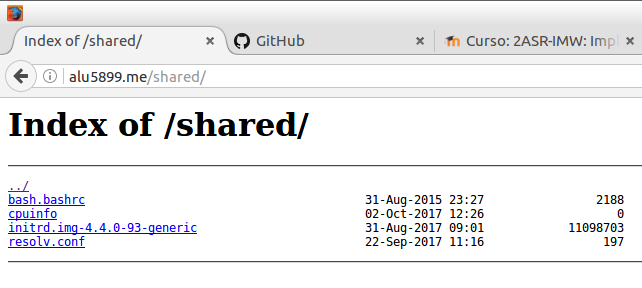

# 1. Listado de directorios.
## 1.1 Explicación del proceso.

Nos dirigimos al directorio *sites-available* donde modificaremos el archivo *alu5899*, añadiendo la *location /shared* en el directorio */home/alu5899/webapps* y la característica *autoindex on*, la cual nos mostrara el contenido de la carpeta en el servidor Web como si fuera un FTP.

  

Hacemos el enlace simbólico en la carpeta *sites-enabled* con:
> ln -s ../sites-available/alu5899

  

Luego nos dirigimos a la carpeta de *shared* donde haremos los siguientes enlaces simbólicos para que se muestren en el servidor.  

  

Y esto sería el resultado final.  

