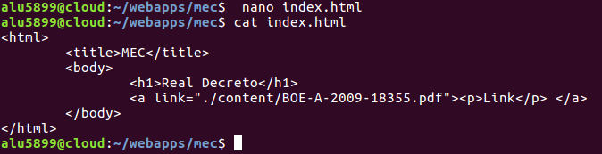
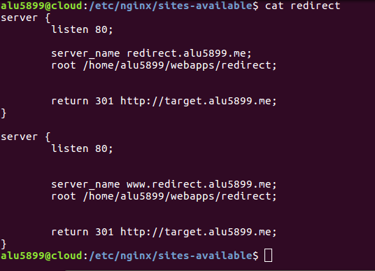

# A3-Páginas Web
## 1. Página Web 1.
### 1.1 Proceso.
Creamos la carpeta *imw* en *alu5899*, junto con el *index.html*.  
  

Configuramos la página web en *sites-available* con una *location* llamada *mec*, localizada en *./alu5899/webapps*.  
  

Activamos la página web situando un enlace simbólico en *sites-enabled* y reiniciamos el servicio para que se cargue la nueva configuración.  
  

El contenido que mostrará *imw.alu5899.me*.    
  

Tenemos que subir el *pdf* desde la máquina real con el comando *scp*. Luego lo movemos a la carpeta situada en *./alu5899/webapps/mec/content/* y agregamos un link de descarga en el *index.html* que mostrará la web.
  

  

### 1.2 Comprobación.  
Así quedaría *imw.alu5899.me* .

Así quedaría *imw.alu5899.me/mec* .  

## 2. Página Web 2.
### 2.1 Proceso.  
Creamos un archivo de configuración en *sites-available* con la siguiente configuración. Es importante el *autoindex on* dado que de no ponerse, no se mostraría el listado que deseamos.
  

Y lo activamos en *sites-enabled*.  
   
### 2.2 Comprobación.  
Así quedaría *varlib.alu5899.me:9000*. Si no se especifica el puerto, no se podrá ver.

## 3. Página Web 3.
### 3.1 Proceso.  
Modificamos el archivo de configuración *ssl* localizado en *sites-available* y añadimos la *location students* con la siguiente configuración.  
  

Con el siguiente comando generaremos una contraseña encriptada con *perl*, que en este caso sería "aula108=saePqpXJa/sVk". Esta contraseña será añadida al fichero oculto previamente creado *./alu5899/webapps/students/.htpasswd* donde están registradas todas las contraseñas de acceso encriptadas, de no ser así, su lectura sería muy sencilla.

Finalmente, añadimos una *location* para *.htpasswd* en la que se denegará todo el acceso a cualquier usuario que intente acceder a él vía web.  

### 3.2 Comprobación.
Comprobamos que el usuario y la contraseña configuradas funcionan.
  

Éxito.  
  

Si intentamos acceder a *.htpasswd* la línea *deny all* nos prohibirá el acceso.  

## 4. Página Web 4.  
### 4.1 Proceso.  
Generamos un archivo de configuración *redirect* en *sites-available* con la siguiente configuración. En él las peticiones web que se realicen por el puerto 80 como *http://redirect.alu5899.me/estoesunejemplo/* será redirigidas a *http://target.alu5899.me*.  
  

Subimos el *zip* que contiene la página web del *target* desde la máquina de producción a la de desarrollo con el comando *scp*.  Los descomprimimos y lo colocamos en la ruta especificada previamente en el archivo de configuración.
  

  

Activamos en *sites-enabled* el archivo de configuración *redirect*.  
  

Generamos un archivo de configuración para la página web *target* y la activamos. Añadimos las rutas para *access.log* y *error.log*.  
  

Ahora crearemos la carpeta *redirect* en */var/log/nginx*, la cual contendrá los ficheros *access.log* (listado de accesos a la página) y  *error.log* (listado de accesos fallidos a la página).
  

Así quedarían las carpetas de *redirect* (vacía) y *target*.
   

Finalmente, es importante hacer un *reload* después de haber terminado toda la configuración y revisar que no hay errores.   
En mi caso me topé con que los ficheros de *log* no estaban creados y tuve que crearlos para solucionar el problema.

### 4.2 Comprobación.  
La configuración ha sido un éxito.
  
