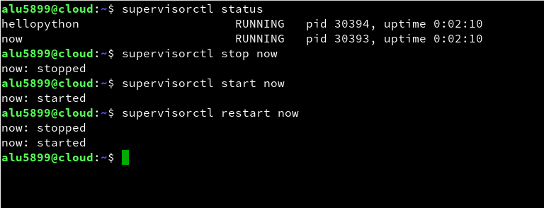

# UT1-A4: Sirviendo aplicaciones Php y Python.
## 1. Página Web 1.
### 1.1 Proceso.
Nos dirigimos al directorio `/etc/nginx/sites-available` y creamos un nuevo archivo de configuración para la aplicación de *PHP* con los siguientes parámetros:  
  
Hay que indicarle que la extención del *index* será *index.php*, crear una *location* para que "lea" los ficheros que acaben en *.php* y en él añadir la ruta al archivo de configuración junto con el *socket* que se encargará de controlar las peticiones de entrada y salida.  

Nos dirigimos a `/etc/nginx/sites-enabled` para activar el archivo de configuración con un enlace simbólico.        
  

Y recargamos el servicio.  
  

Por último, subimos el archivo de la activad con el comando *scp archivo host:ruta*   y lo descomprimos en la siguiente carpeta:  
  

### 1.2 Comprobación.    
Éxito.  php.alu5899.me  
    

## 2. Página Web 2.
### 2.1 Proceso.
Nos dirigimos al *home* del usuario y buscamos la carpeta oculta de *.virtualenvs* para crear el directorio *now*, que alojará el *socket uwsgi* y los *frameworks* de *python*-*flask*.  
  

Creamos el entorno virtual con el siguiente comando.

Y comprobamos que el entorno virtual funciona.    
  

Creamos el directorio `/home/alu5899/now/` que contendrá la aplicación escrita en *python*.   
   

Generamos el fichero *main.py* con el siguiente código.  
  
Ya tendríamos hecho todo lo que sería la parte de código. Ahora pasaremos a la instalación del *socket* y los *frameworks* necesarios para el funcionamiento de esta *app*.

Activamos el entorno virtual e instalamos *uwsgi* con *pip*.    
  

Hacemos lo mismo con *flask*.  
    

Salimos del entorno virtual y creamos el archivo de configuración en *sites-available* con la siguiente configuración (static=css,png...).  
  

Activamos la página en *sites-enabled*.    
    

Volvemos a activar el entorno virtual de *now* y lanzamos el comando `uwsgi --socket 0.0.0.0:8080 --protocol=http -w main:app`  para activar en la propia máquina por el puerto 8080 la aplicación de *main.py*.  
  

Abrimos el navegador y comprobamos rápidamente que ha funcionado.  
    

### 2.2 Supervisor.
Si queremos que la aplicación sea ofrecida permanentemente tendremos que configurar un supervisor, un servicio que la ofrecerá la web.  
  

Creamos un *script* en la carpeta *now* que lanzará el servicio.  
    

Otorgamos permisos de ejecución a el grupo y a otros para que lo puedan ejecutar.   
     

Por último, nos dirimos al directorio `/etc/supervisor/conf.d` y creamos el archivo *now.conf* con la siguiente configuración.  
   

Reiniciamos y comprobamos el estado del nuevo servicio de diversas formas.
   

  

---
### 2.3 Actualización y comprobación.    
Instalamos *pytz* en el entorno virtual de *now*.
    

Y este sería el resultado final si aplicaramos la modificación del código de *main:app* proporcionado en la activad. now.alu5899.me
  
