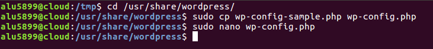

# Wordpress.  
   

## 1. Instalación.
Comenzamos el proceso de instalación entrando en nuestro previamente configurado mysql.  
    

Creamos una base de datos llamada *wpdatabase*.  
  

Creamos un usuario llamado *wpuser@localhost* con contraseña *Testing_1234*, con todos los privilegios sobre la base de datos *wpdatabase*.  
    

Hecho esto, procedemos a descargar en ``/tmp/`` los ficheros de instalación de *Wordpress*.  
    

Y los descomprimimos.  
    

Lo copiamos en ``/usr/share/`` y nos damos cuenta de que el usuario y el grupo están establecidos como ``root``, cosa que habrá que cambiar para que *Wordpress* pueda funcionar correctamente.  

Cambiamos el usuario y el grupo a ``www-data``.  
    

Modificamos copiamos y modificamos *wp-config*, introduciendo los valores de nuestra base de datos de MySql.  
    

    

Llegados a este punto, creamos el sitio en *Nginx* con la siguiente configuración.  
    

   

   

Reiniciamos el servicio para cargar la nueva configuración.
     

Si todo ha salido bien, deberíamos poder entrar a la siguiente página.  
     

Configuramos el sitio con los siguientes datos.  
    

Y si aparece esta captura, habremos instalado *Wordpress* correctamente.  
  

## 2. Links permanentes.  
Entramos con el usuario creado.  
    

En la zona de ``Ajustes > Enlaces predeterminados`` seleccionamos la opción *Día y nombre*.  
    

Y en el archivo *wordpress* de *Nginx* añadimos la *location* especificada en la captura y reiniciamos el servicio.  
    

    

    

## 3. Tema.  
En esta pestaña cambiaríamos el tema.  
    

  

## 4. Añadir una nueva página.  
En esta pestaña cambiaríamos el tema.
   

http://wordpress.alu5899.me/estadisticas-wordpress/
