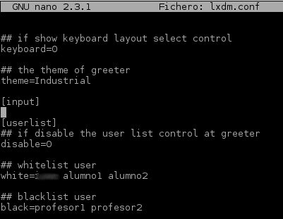

```
* Recopilación de infomación en relación a la apariencia del sistema.
* NO ESTÁ PREPARADA PARA USARSE COMO ACTIVIDAD
```

# Apariencia

## A.2 Desktop Manager

kdm
* Buscar aplicación kdm por entorno gráfico.
* Configurar usuarios excluidos de la ventana de inicio.

lxdm
* Es el gestor de inicio por defecto para OpenSUSE12.3 con escritorio LXDE.
Veamos ejemplo:


```
disable=1, oculta la lista de usuarios completa.
white list: son los usuarios a mostrar.
black list: son los usuario a ocultar.
```

lightdm
* Suele ser el gestor de inicio por defecto de instalaciones con el escritorio LXDE y XFCE.
* El fichero de configuración de **lightdm** suele estar en `/etc/ligthdm/`
o `/etc/ligthdm/lightdm.conf.d/`.
* Enlaces de interés:
    * [http://geekland.hol.es/personalizar-y-configurar-lightdm/](http://geekland.hol.es/personalizar-y-configurar-lightdm/)
    * [http://askubuntu.com/questions/92349/how-do-i-hide-a-particular-user-from-the-lightdm-login-screen](http://askubuntu.com/questions/92349/how-do-i-hide-a-particular-user-from-the-lightdm-login-screen)

* Para ocultar la lista de usuarios completa:
    * Editar el archivo `/etc/lightdm/lightdm.conf`.
    * Para ocultar la lista de los usuarios, añadir la siguiente línea en la sección [SeatDefaults]
```
[SeatDefaults]
...
greeter-hide-users=true
```

gdm3
* Suele ser el gestor de inicio por defecto para instalaciones con el escritorio GNOME.
* Con gdm3, los pasos son:
    * Abrimos consola y entramos como `root`, y editamos el archivo `/etc/gdm3/daemon.conf`.
    * En la linea bajo `[Greeter]` añadimos `Exclude=jedi1, sith1`.
    * Guardamos el archivo y reiniciamos.


> Parece que la configuración anterior de Gnome3 en Debian7 tiene un bug.
A continuación se muestra un modo de ocultar la lista de los usuarios al inicio de sesión.
>
> ```
> nano /etc/gdm3/greeter.gsettings
> ...
> # Greeter session choice
> # ======================
> [org.gnome.desktop.session]
> session-name='gdm-fallback'
> # session-name='gdm-shell'
>
> # Login manager options
> # =====================
> # - Disable user list
> disable-user-list=true
> ...
> ```

## A.3 Activar entorno gráfico con System V
Actualmente la mayoría de las distribuciones GNU/Linux tienen Systemd en lugar de SystemV.

Para volver a poner la activación del entorno gráfico automático al inicio hacemos:
```
cd /etc/rc2.d/DISABLED
mv S20gdm3 ..
```

## A.5 Modificar apariencia Lubuntu a MAC

* Primero debemos descargar e instalar las apariencias de las ventanas
y demás en el siguiente [enlace](http://sourceforge.net/projects/mac4lin/)
* Una vez instalado procederemos a activarlas manualmente en el asistente de
personalizacion del sistema. (Preferencias->Personalizar apariencia y comportamiento)
En las pestañas control y borde de ventana
* Luego ponemos estos comandos en consola como root para instalar un software
de personalizacion de barra de tarear llamado Cairo Dock.

    sudo add-apt-repository ppa:cairo-dock-team/ppa
    sudo apt-get update
    sudo apt-get install cairo-dock cairo-dock-plug-ins

* Y por ultimo buscamos el Cairo Dock modo gráfico y lo personalizamos.
* Para personalizar el Cairo-Dock y agregar los iconos de Mac--> (click derecho sobre la barra-->Cairo-Dock-->configurar-->temas (Importamos el tema macOSX)
