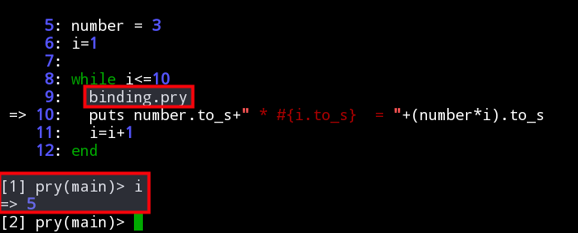

# Depuración de programas

Según Wikipedia, depuración de programas es el proceso de identificar y corregir
errores de programación (debugging).

Tenemos varias caminos a la hora de depurar programas:
* Usar `print MESSAGES`
* Usar herramienta de depuración
* Usar unidades de prueba
* etc.

## print MESSAGES

El método más rudimentario es el de incorporar en nuestro programa líneas
que den salida por pantalla de los resultados de nuestro programa en los puntos
de ejecución que queramos revisar.

## Recomendado

El método anterior es muy rudimentario así que vamos a mejorarlo.
Lo recomendado es usar una herramienta específica para depurar código.
En nuestro caso, hacemos:
* `gem install pry-byebug`, Esta es la instrucción para instalar una
gema/librería/pluggin, para ampliar nuevas funciones de nuestro ruby.

> En Ubuntu/Debian haremos lo siguiente para instalar la gema:
>
> * `apt-get install -y ruby-dev`, esto instala headers necesarios para compilar.
> * `gem install pry-byebug`


* Editamos el programa que queremos depurar.
* Añadimos la siguiente línea al comienzo:
```
#!/usr/bin/ruby
require 'pry-byebug'
...(Nuestro código)
```
* Añadimos la siguiente línea dentro de nuestro código. En el punto donde
queremos que empiece a funcionar nuestro depurardor.
```
...(Nuestro código)
binding.pry
...(Nuestro código)
```
* Grabamos los cambios y salimos del editor.
* Ejecutamos el programa.



* Cuando se llega a la instrucción `binding.pry`, el depurador entrar en
funcionamiento. Se abre un intérprete interactivo de ruby donde podemos:
    * Consultar el estado de las variables del programa.
    * `next`, para ejecutar la siguiente instrución.
    * `step`, para ejecutar la siguiente instruccion paso a paso.
    * `exit`, salir del depurador y continuar el programa de forma normal.
* Al terminar la depuración bastará con quitar la línea `binding.pry` de nuestro código.
