# Servidor DHCP-Windows.
## 1 Intalación DHCP.
### 1.1 Instalación del servicio.
Según iniciamos el servidor nos aparecerá la ventana de administración del servidor. Nos dirigimos a la sección de agregar roles y características.  
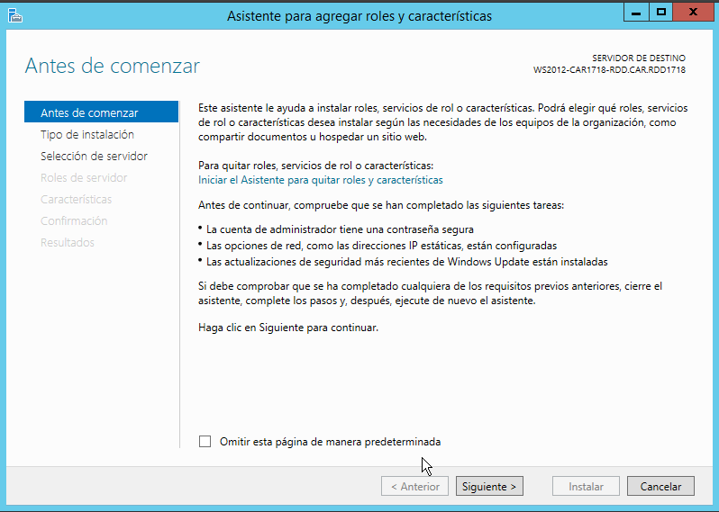  

Seleccionamos el servidor. En este caso solo disponemos de uno.
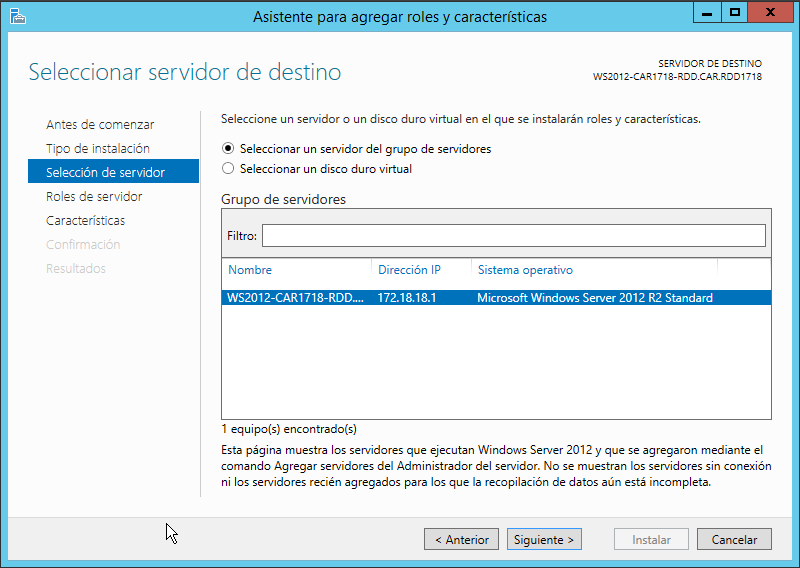   

Agregamos el rol de DHCP.
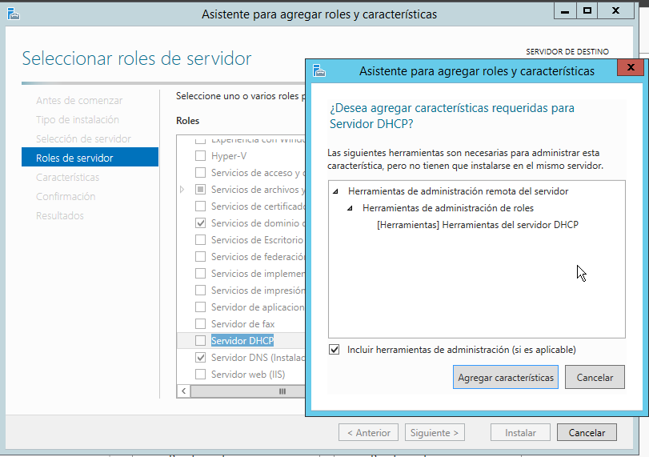  

Aquí no necesitaríamos hacer nada, dejando las opciones por defecto.   
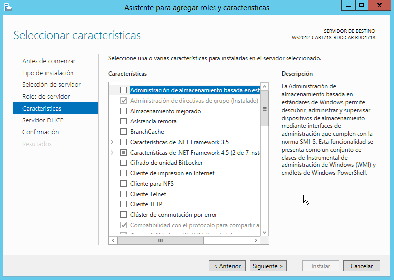  

Comenzamos la instalación del servicio DHCP.   
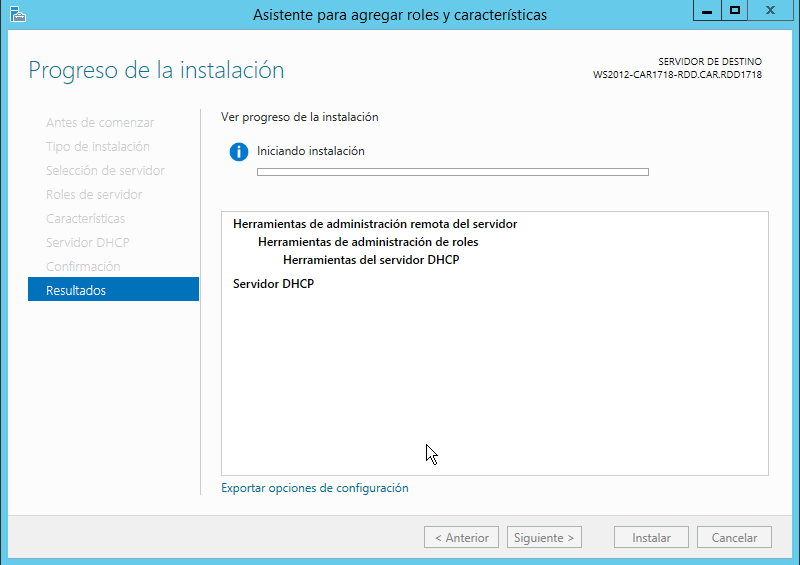  

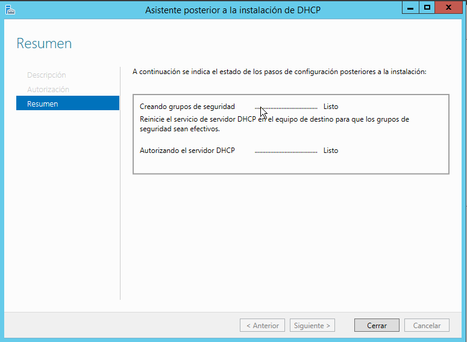  

### 1.2 Configuración DHCP y creación de ámbitos.
Una vez finalizado, desplegamos la pestaña de herramientas y selecionamos DHCP.    
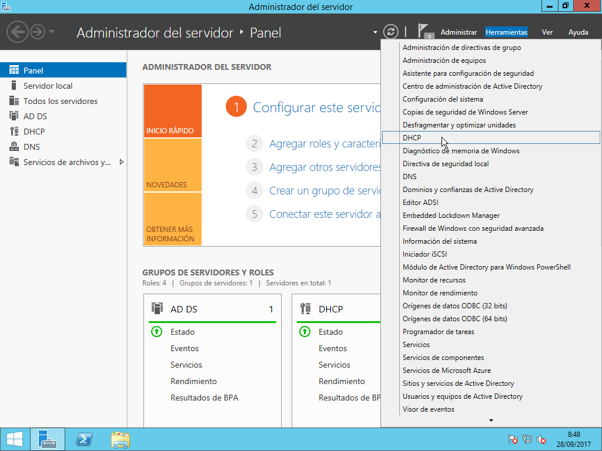    

Nos dirigimos a la barra lateral de la izquierda, secundario del ratón y seleccionamos ámbito nuevo.
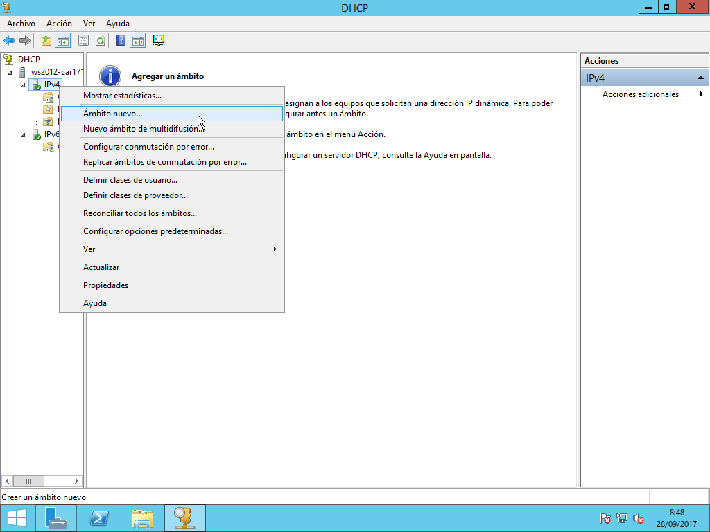  

Seleccionamos un rango IP para el primer *pool* DHCP.  
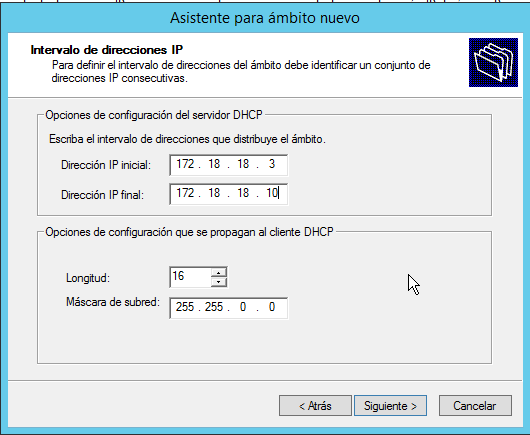  

Agregamos una exclusión.  
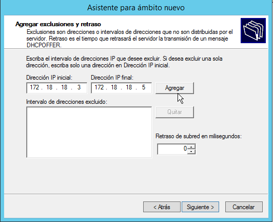  

Aquí podremos fijar cuanto tiempo va a tardar la tabla *ARP* en reiniciarse. Si a una dirección MAC se le ha dado cierta IP, se le intentará volver a dar la misma.   
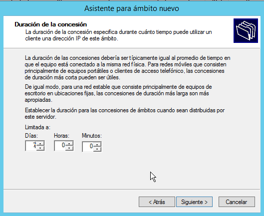  

Finalizamos y tendremos el ámbito configurado.  
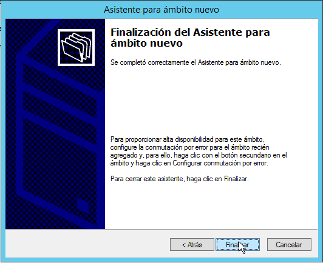  

Le asignamos una IP al servidor en la misma red que el *pool* que hemos configurado. Esto no sería necesario en un escenario real ya que se estaría utilizando un router. En esta práctica se están utilizando adaptadores de red en modo "Red Interna" para no descontrolar la red del centro.  
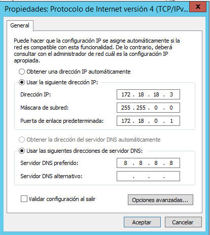  

IP del servidor.  
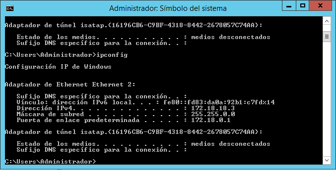

IP de la máquina cliente recibida vía DHCP.  
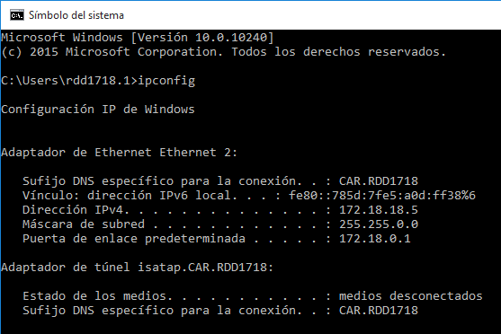  

Creamos un nuevo ámbito para comprobar que se hacen los respectivos cambios de *pool* y configuración.
Esta parte ha resultado ser de lo más frustrante. Si desactivamos el 1º ámbito, es muy complicado que haga el cambio
por si mismo, teniendo muchas veces que reiniciar el servidor o incluso borrar el 1º ámbito para que consiga la nueva configuración.
La cosa cambia si estamos en el 2º ámbito, el cual si desactivamos cambiará al primer ámbito sin ningún problema. Supongo que será un error de software al estar usando máquinas virtuales o que no se está utilizando un router.  
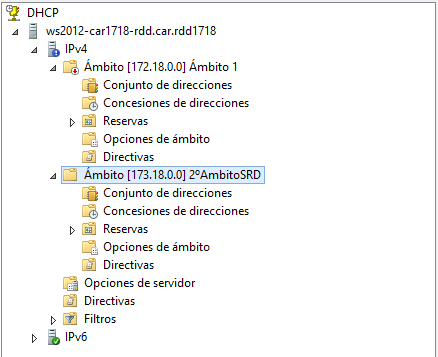  

Servidor:    
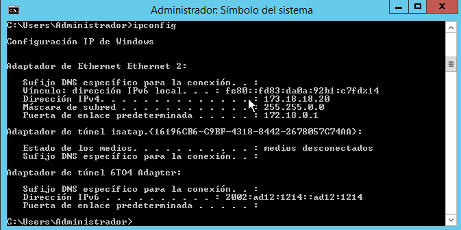  

Cliente:    
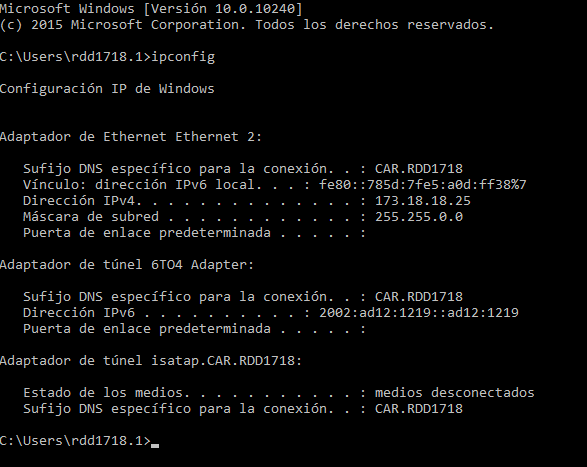  

En este paso se fusionarán los dos ámbitos para crear lo que se conoce como un superámbito. Con esto se puede ahorrar mucho tiempo a la hora de realizar configuraciones nuevas, dado que se pueden configurar varios ámbitos simples al mismo tiempo.  
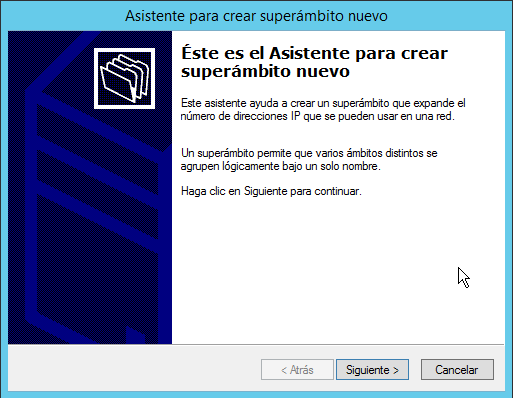  

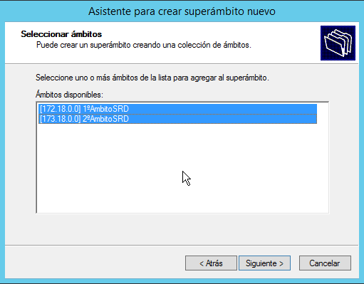    

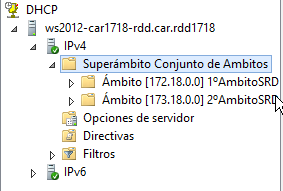  

Lo desactivamos para comprobar que se deja de enviar información a el cliente.  
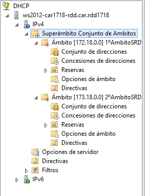

Y funciona.  
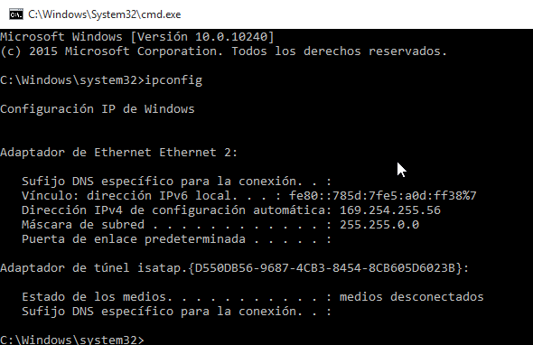
### 1.3 Reserva.
Por último, con esta opción podremos especificar al servidor IP que una MAC concreta tenga preferencia a la hora de obtener una IP. Lo podremos configurar si desplegamos el servidor y vamos al fichero de "Reserva".
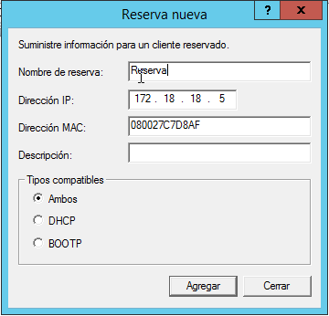  

Y efectivamente, el cliente se ha saltado la ip *172.18.18.4*    (que sería la priemera IP del *pool* )  y ha recibido la IP configurada.
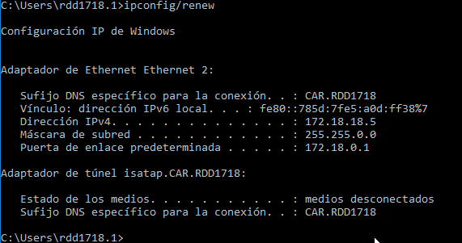  
