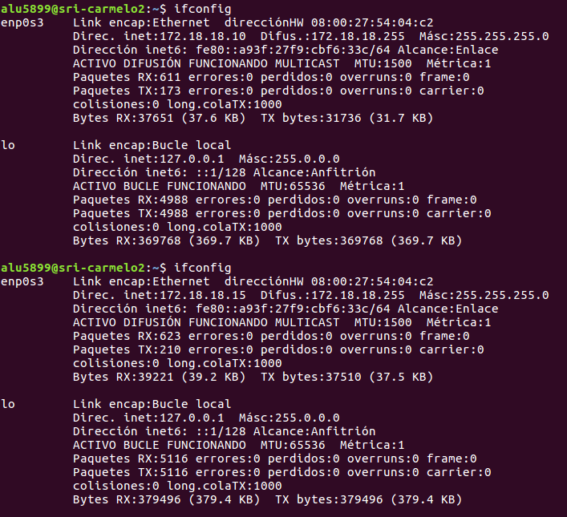

# 1. DHCP-LINUX
## 1.1 Instalación y configuración.
Se asignó una IP estática al servidor y tarjetas internas en ambas máquinas.
Descargamos el paquete *isc-dhcp-server*.
  

Editamos el archivo de configuración localizado en */etc/dhcp/dhcpd.conf* y añadimos el siguiente *pool*.
  

Arrancamos el cliente y comprobamos si se ha compartido la configuración. Es MUY IMPORTANTE que cada línea esté escrita correctamente en el archivo de configuración del servidor, de lo contrario, la tarjeta de red del cliente no hará más que fallar.  
  

## 1.2 Reserva
Para configurar una reserva en linux tendríamos que añadir las siguientes líneas en el archivo de configuración.
  

Comprobamos la configuración en el cliente.
  

# 2. Windows.
Este paso no era necesario pero me pareció curioso comprobar si funcionaría correctamente.

