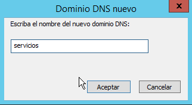

# A3 - DNS Windows Server 2012.
## 1. Configuración.  
### 1.1 Servidor.  
Nos dirigimos  a la herramienta de gestión preinstalada de DNS.  
    

Desplegamos el dominio y creamos una nueva zona directa.  
  

Seguimos todos los pasos predefinidos para esta práctica.  
  

  

  

Aquí es importante mencionar que el nombre no contenga  caracteres extraños, como guiones, "@""...(más tarde se cambiaron por puntos).  
  

  

  

Ahora, crearemos una zona invertida, siguiendo la configuración mostrada.  
  

  

  

   

El siguiente paso de la actividad sería configurar los reenviadores. Para ello tendremos que abrir las propiedas del dominio.  
  

Y abrir la pestaña de  reenviadores donde agregaremos los servidores DNS.  
  

En caso de ser verificados, se mostrarán de la siguiente manera:    
    

   

De esta manera, habremos configurado un servidor DNS *cache*, ya que este es capaz de redirigir a otros servidores.  Para hacer un *master*, habría que alojar las traducción de nombres e *Ips* en la propia máquina y especificar en la configuración estática del adaptador de red la misma máquina como servidor *DNS*.    

Una breve comprobación en el servidor de si hay internet.  
    

Como se pedía en la actividad, tenemos que crear un alias. Para ello previamente habrá que crear  un host nuevo o un campo "A".  
  

Una vez creado el host le podremos asignar un alias.  
  

Aquí se asignaría un servidor de correo o campo "mx".  
  

Lo siguiente que se pedía era crear una impresora con un *A* y un *CNAME*.
    

A continuación, creamos un nuevo dominio llamado "Servicios", que contendrá un ftp, una segunda impresora y un equipo administrador.  
  

    

    

   

## 2. Comprobaciones.
Nos dirigimos a la configuración del adaptador del cliente y redirigimos el servidor *DNS* a nuestro servidor.  
    

Ya para finalizar, realizamos las últimas comprobaciones con el conmando *nslookup dominio*.  

    

   

Para comprobar que la conexión es real, asignamos la *Ip* de *printer* al cliente y volvemos a comprobar.
    

    

    

    

  
