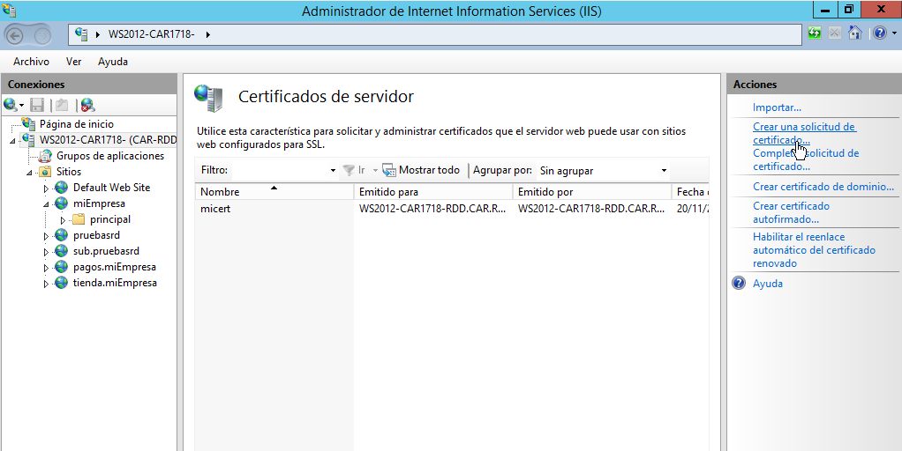

# Servidor Web Avanzando - Parte I.  
  

(parte II más abajo)
## Proceso y configuración de SSL.
- Comenzamos la práctica creando el los directorios *miEmpresa* y *principal* en `c:\miEmpresa\principal`.  
  

- Agregamos una zona de búsqueda directa nueva llamada *miEmpresa.com* y agregamos un campo *A* haciendo referencia a la IP *172.18.18.10*.  
    

    

- Creamos una página Web en el administrador de *IIS*.  
    

  Y comprobamos (se activó el examen de directorios por error, no hace falta ).
    

- Agregamos al grupo todos dentro de los grupos permitidos, de lo contrario no podremos ver la págiga en el buscador (error de permisos).  
    

## Creamos el subdominio *pagos*.
- Ahora, creamos un subdominio llamado pagos.
    

- Cremaos una página web en *IIS* y comprobamos su funcionamiento.  
    

    

## Agregamos el certificado al subdominio *pagos*.
- Desde IIS, nos dirigimos a certificados del servidor.  
    

- Seleccionamos *Crear certificado autofirmado*.  
  

- Modificar enlances.  
   

- Y rellenamos los campos como se muestran a continuación.  
   

    

- Quedando algo así (se ha eliminado el http por el puerto 80).  
    

- Y comrpobamos en el navegador.  
    

## Creamos el subdominio *tienda*.
- Agregamos un subdomino con un campo *A* en el DNS.  
   

- Agregamos una página en IIS y la vinculamos al previamente creado subdominio.  
   

## Agregamos el certificado al subdominio *tienda*.    
- Una vez hecho esto, procedemos a la instalación de *OpenSSL*.  
   

- Volvemos a los certificados del sevidor y seleccionamos *Crear una solicitud de certificado*.
    

- Rellenamos los campos de la siguiente maneras y le damos a siguiente.  
   

- Colocamos estos campos.  
    

- Y seleccionamos una ruta para exportarlo.  
    

- Comprobamos su contenido en un bloc de notas.  
    

- Copiamos este certiciado y lo depositamos en `C:\OpenSSL\bin`.  
   

- Hecho esto, ejecutamos *OpenSSL.exe* y se abrirá una consola en la cual introduciremos
`genrsa -des3 -out cakey.pem 2048` que generará una clave privada.  
     

- Generamos el certificado digital con `req -new -x509 -key cakey.pem -out cacert.pem -days 365`, rellenando los campos pertinentes.  
   

- Y creamos el certificado digital para el servidor de IIS con `openssl x509 -req -days 365 -in certreq.txt -CA cacert.pem -CAkey cakey.pem -CAcreateserial -out iis.crt`.  
   

- Comprobamos que se han generado los archivos especificados.
    

- Volvemos al administrador de IIS y en certificados del servidor, seleccionamos *Completar solicitud de certificado*.  
   

- Seleccionamos la ruta en la que se encuentra el certifcado digital generado previamente.  
   

- Volvemos al subdomino *tienda* y en *Enlances* seleccionamos el certificado ya cargado en el servidor IIS.  
   

      

- Llegados aquí, toda la configuración ha sido realizada y lo comprobamos de diversas maneras:  
- SSL en servidor.  
    

- Sin SSL en servidor.  
   

- SSL en cliente.
    

- Sin SSL en cliente.  
    

# Servidor Web Avanzando - Parte II.     
- Creamos un nuevo subdominio.  
     

- Agregamos un nuevo sitio web al servidor de IIS.   
     

- Vamos al directorio y creamos los archivos e index necesarios. Aquí un ejemplo con *empleado2*.  
     

- Volvemos al servidor de IIS y activamos el *examen de direcotiros* y en *autenticación* nos aseguramos que la configuraciguración sea como se muestra en las capturas.  
     

- En cada carpeta.  
     

- En la página web general.  
     

- Y en el servidor.  
  

- Ahora agregamos a los usuarios empleado1, empleado2, empleado3 en Usuarios y equipos de *Active Directory*.     
    

- Y al grupo common.  
   

- Una vez hecho esto, desabilitamos la herencia en todas las carpetas implicadas en la práctica y les asignamos sus respectivos propietarios.  
     

       

       

      

       

- Para finalizar, comprobamos que nos pida la contraseña de cada usuario en sus respectivos directorios.  
     

      

      
- Una vez entrado con un usuario dentro de *common*, no hará falta introducir una nueva contraseña.    
    

      

      

      

          

Nota: - Revisar el archivo *web-config* en caso de fallo, suele dar problemas de permisos. Una vez modificado, se tomará cierto tiempo.
